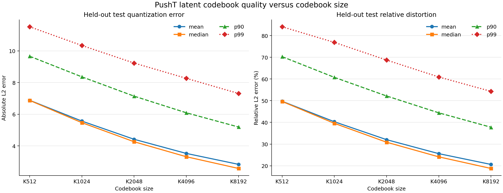
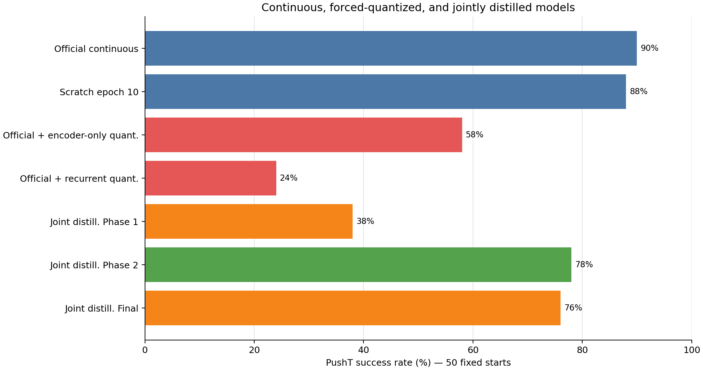
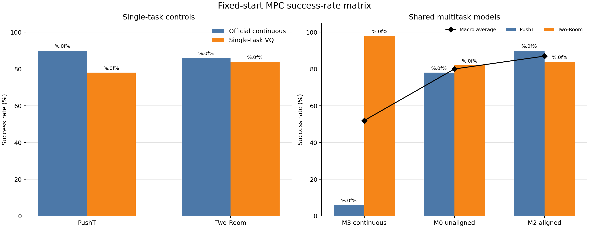
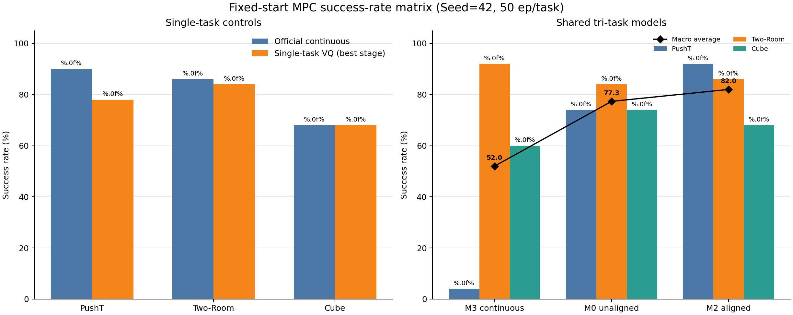
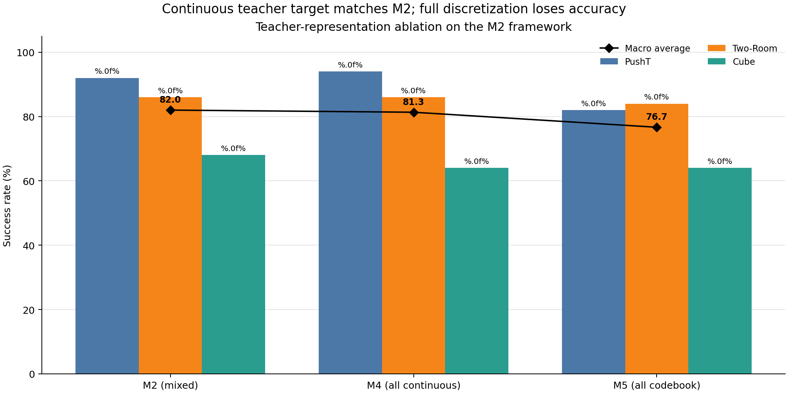
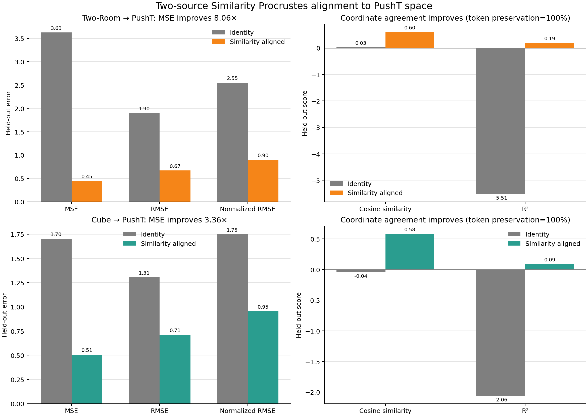
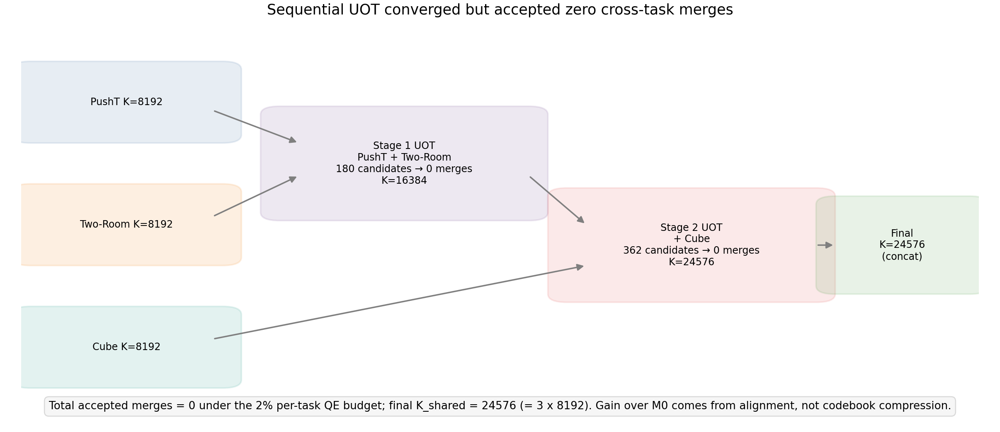
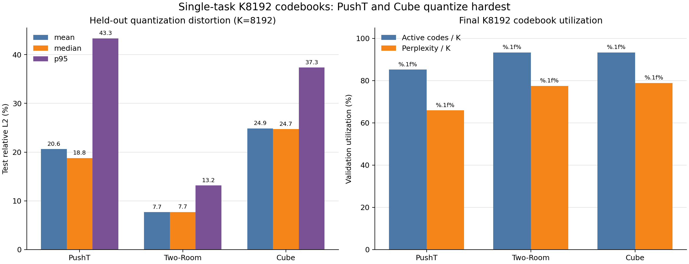

# 从任务专家到共享世界模型

> **经验整合与统一隐空间**:多任务世界模型不应靠把所有任务塞进一次端到端优化来获得;表征学习与隐空间塑造应当能够逐任务、可控地进行,已有模型的经验应当以可对齐、可组合的形式被新模型继承。

单任务世界模型易于训练,但当多个任务共享同一模型、同一隐空间与同一优化目标时,任务间干扰会导致性能严重失衡。本项目提出一条区别于端到端单体训练的扩展路径:不直接联合训练一个易受任务干扰的多任务模型,而是将单任务专家的隐空间离线缓存为教师表示并离散化为冻结码本,用其作为学生表示的几何约束;在此基础上用 Similarity Procrustes 把各专家的隐空间与码本统一到一个坐标系,再通过渐进式蒸馏将多个专家的能力整合进一个共享模型。三种实例化在 PushT 与 Two-Room 的双任务设置下,将原生连续多任务训练 6% / 98% 的严重失衡纠正为 90.7% / 84.0% ;任务数扩展到 3 个时（增加Cube任务）,失衡由4% / 92% / 60%）纠正为90.3% / 85.3% / 65.3% 。平均提升幅度为双任务 35.3pp、三任务 28.0pp。

---

## 核心结论

1. **经验整合显著优于原生联合训练。** 三种监督实例化的宏平均全部不低于其监督源:双任务连续/混合/离散为 90%/87%/85%,三任务为 81.3%/82.0%/76.7%;原生联合训练在两种设置下均为 52%(52.0%)。提升幅度为双任务 33–38pp、三任务 24.7–30pp。
2. **连续版:整合可以是正项。** 双任务 PushT 94%,高于其教师专家的 90%;宏平均 90%,高于教师宏平均 88%。任务数从 2 扩展到 3 时,连续版已有任务持平(94/86),混合版上升(90→92、84→86)。这是正向规模迹象(positive scaling trend);2→3 个任务不足以确立 scaling law。
3. **离散版:整合零损失,损失全部来自量化。** 三任务下,连续版宏平均(81.3%)与三个连续教师的宏平均一致,离散版(76.7%)与三个离散专家的宏平均一致;连续减离散的差距(4.6pp)与专家层离散化的成本(81.3%−76.7%)一致。共享模型完整继承了监督源的水平,误差来自连续→离散的量化近似,不来自整合过程。
4. **隐空间坐标对齐是独立的收益来源。** M0 与 M2 的唯一差异是 Procrustes 对齐:双任务宏平均 80%→87%(+7pp),三任务 77.3%→82.0%(+4.7pp);收益集中于量化最困难的 PushT。对齐保持 token 分配 100% 不变。
5. **离线量化精度不能预测闭环性能。** 码本从 K512 扩到 K8192,测试量化误差下降 58.76%;held-out 成功率却始终集中在 74%–76%,三组配对比较的 90% 置信区间均跨越零点。
6. **推理时强制离散化不可行,训练时联合适配可行。** 对连续模型直接量化,成功率从 90% 降至 58%;递归量化进一步降至 24%;在训练阶段联合适配冻结码本可恢复至 78%。作为对照,无教师监督、无防坍塌正则的 prediction-only 训练把预测误差降至近零,成功率却只有 3.5%。

> **探索性结果的定位**:UOT 码本融合(零合并)与隐空间刚体变换(+4.5pp,置信区间跨零)均为单 seed 探索,不构成主要主张,见实验部分末尾两节。

---

## 方法

```
单任务专家 ×N
   │  Extract     冻结 encoder,从连续 latent 学习 K8192 码本;
   │              离线缓存教师表示(连续向量与码字同时缓存)与软 token 分布
   ▼
冻结离散码本 + 教师缓存
   │  Align       同图像 anchor + Similarity Procrustes 统一各专家坐标系
   │              (相似变换均匀缩放距离 ⟹ token 分配严格保持 100%)
   ▼
统一坐标系
   │  (Fuse)      顺序 UOT 码本融合,每任务量化误差预算门控(探索性,本轮 0 合并)
   ▼
   │  Consolidate 三阶段 teacher forcing(4/10/2 epochs),渐进蒸馏进共享模型
   ▼
一个共享世界模型(引入新任务后重复该流程)
```

**统一训练目标(一个范式,教师监督信号 $r^T$ 是实例化开关):**

```
L = 1.0·L_pred(教师源 r^T 的 teacher forcing)  +  1.0·L_latent(MSE 到 r^T)  +  0.1·L_soft(冻结码本上的 soft KL)
```

| 实例化 | $r^T$ | 软 token 项 | 回答的问题 |
|---|---|---|---|
| **连续版(仓库代号 M4)** | 连续向量 $z^T$(量化前) | 关闭 | 整合的性能上限;规模迹象 |
| **离散版(M5)** | 码字 $c_{y^T}$(量化后) | 保留 | 离散接口充分性;误差来源 |
| **混合版(M2)** | 第一项连续向量,动力学教师源为码字 | 保留 | 连续精度 × 离散几何互补 |

三种实例化共享相同的码本、缓存、网络结构与训练调度,唯一差异是教师监督的表示形式。单任务专家(P1/R1/C1)采用混合实例化。冻结码本并非推理时需查询的外部存储,而是为学生表示提供稳定几何约束的训练工具;部署时仅保留学生模型。

---

## 实验

### 模型命名约定

| 记号 | 任务 | 训练方式 | 角色 |
|---|---|---|---|
| **P0/R0/C0** | 单任务 | 官方连续教师 | 性能上界 |
| **P1/R1/C1** | 单任务 | 单任务 K8192 离散蒸馏(混合实例化) | 离散专家 |
| **M4** | 多任务 | 对齐融合码本;教师信号全连续向量 | **实例化:连续版** |
| **M5** | 多任务 | 对齐融合码本;教师信号全码字 | **实例化:离散版** |
| **M2** | 多任务 | 对齐融合码本;连续 MSE + 软 token + 码字动力学 | **实例化:混合版** |
| M0 | 多任务 | 多教师蒸馏,码本**直接拼接**(不对齐) | 对照:消融"有无跨任务对齐" |
| M3 | 多任务 | 原生连续多任务:无教师、无对齐、无码本 | 对照:单体基线 |

> 实现上 `MultiTaskObjective` 提供三个开关:`latent_target` ∈ {continuous, codebook}、`prediction_source` ∈ {continuous, codebook}、`token_weight`;默认值对应混合版 M2,M4 = {continuous, continuous, 0},M5 = {codebook, codebook, 0.1}。三种实例化复用同一融合码本与缓存,教师信号全部处于对齐后参考系——M2/M4/M5 之间唯一受控差异是教师监督的表示形式。
> **M0 与 M2 的唯一差异为 Procrustes 坐标对齐这一步骤**,网络规模、码本容量、三阶段调度、GPU 数、global batch、数据划分与随机种子均严格一致——这构成判断对齐作用的受控证据。

### 码本扩容:量化精度单调提升,但有效容量利用率递减

| 码本 | 测试绝对 L2 均值 | 测试相对 L2 | Active fraction | perplexity/K |
|---:|---:|---:|---:|---:|
| K512  | 6.8794 | 49.73% | 100.00% | 93.32% |
| K2048 | 4.4187 | 32.04% | 99.71%  | 85.95% |
| K8192 | **2.8373** | **20.62%** | 85.21% | 65.91% |

K8192 的量化误差最低,但有 1212 个码字在验证集中从未被激活:名义容量的增长明显快于有效容量。



### 强制量化 vs. 联合蒸馏(50 个固定 PushT 起点)

| 模型 | 成功率 | 相对官方连续模型 (P0) |
|---|---:|---:|
| P0 官方连续模型 | 90% | — |
| K8192 encoder-only 强制量化 | 58% | −32 pp |
| K8192 recurrent 强制量化 | 24% | −66 pp |
| **P1 冻结码本联合蒸馏** | **78%** | −12 pp |

推理时把连续表示强行换成离散表示会大幅损失性能;在训练阶段让学生与冻结码本联合适配,可以收回大部分损失。



### 码本精度不预测闭环性能(200 个 held-out 起点)

| 条件 | 测试绝对 L2 | Held-out 成功率 |
|---|---:|---:|
| K512  | 6.8794 | 75.5% |
| K2048 | 4.4187 | 74.0% |
| K8192 | 2.8373 | 76.0% |

量化误差跨越约 2.4 倍的范围,闭环成功率却几无变化;三组配对比较的 90% 置信区间均跨越零点。


### 双任务:整合优于原生,连续版反超专家(每任务 50 个固定起点)

| 模型 | PushT | Two-Room | 宏平均 | 角色 |
|---|---:|---:|---:|---|
| M3 原生连续多任务基线 | **6%** | 98% | 52% | 对照:单体基线 |
| M0 未对齐双码本蒸馏 | 78% | 82% | 80% | 对照:无对齐 |
| M2 对齐后双码本蒸馏 | **90%** | **84%** | 87% | 实例化:混合版 |
| M4 全连续教师 | **94%** | 86% | **90%** | 实例化:连续版 |
| M5 全离散码本 | 88% | 82% | 85% | 实例化:离散版 |

- **原生基线(M3)**:PushT 6%、Two-Room 98%。训练日志显示,epoch 7→8 时混合 SIGReg 显著下降,PushT 验证 MSE 从 0.000733 跃升至 0.2699:共享表示为降低跨任务混合正则而牺牲了 PushT 的动力学精度。
- **对齐对照(M0→M2)**:二者唯一差异为 Procrustes 对齐,宏平均 80%→87%(+7pp),收益集中于 PushT(78%→90%);对齐使 held-out MSE 改善 4.63 倍,token 分配保持 100% 不变。
- **实例化比较**:连续版 PushT 94% 高于教师 90%,宏平均 90% 高于教师宏平均 88%;离散版宏平均 85%,高于离散专家宏平均 81%。离散接口承载整合机制同样有增益。



### 三任务扩展:PushT × Two-Room × Cube

对齐阶段独立拟合 Two-Room→PushT 与 Cube→PushT 两个相似变换:held-out MSE 分别改善 8.06 倍与 3.36 倍,token 分配保持 100%(R² 为 0.19 与 0.09)。顺序 UOT 融合的两阶段候选(180 与 362 个)全部被每任务 2% 的量化误差预算拒绝,最终码本为对齐拼接(K=24576)。

| 模型 | PushT | Two-Room | Cube | 宏平均 | 角色 |
|---|---:|---:|---:|---:|---|
| 官方连续教师(P0/R0/C0) | 90% | 86% | 68% | **81.3%** | 上界 |
| 单任务离散专家(P1/R1/C1) | 78% | 84% | 68% | **76.7%** | 离散专家 |
| M3 原生连续多任务 | **4%** | 92% | 60% | **52.0%** | 对照 |
| M0 未对齐拼接 | 74% | 84% | 74% | 77.3% | 对照:无对齐 |
| M2 双源对齐+顺序 UOT | **92%** | **86%** | 68% | **82.0%** | 实例化:混合版 |
| M4 全连续教师 | **94%** | 86% | 64% | 81.3% | 实例化:连续版 |
| M5 全离散码本 | 82% | 84% | 64% | 76.7% | 实例化:离散版 |

- **原生基线(M3)**:PushT 4%,教师为 90%;宏平均 52.0%。
- **对齐对照**:M0→M2 宏平均 +4.7pp(77.3%→82.0%),收益集中在 PushT(74%→92%)。
- **误差归因**:连续版宏平均(81.3%)与教师宏平均一致,离散版(76.7%)与离散专家宏平均一致;连续减离散的 4.6pp 与专家层离散化成本一致。损失来自码本量化,不来自整合;混合版 82.0% 最高,连续精度与离散几何互补。
- **任务扩展**:2→3 任务时,连续版已有任务持平(94/86),混合版上升(90→92、84→86),离散版 PushT 下降 6pp(88→82,合 3 个 episode)。







以上五图依次为:逐任务成功率矩阵、三种监督实例化的比较、双源对齐前后的指标、顺序 UOT 的零合并结果、三个单任务码本的质量。

### 开放探索一:UOT 码本融合——"概念整合"的试验台

人类整合新经验时,等价概念会被合并与泛化,而不是并列封存。我们追问:不同任务的码字若在统一坐标系中几何邻近、占用分布相容,是否对应同一状态概念、能否合并为共享码字。

**协议。** 把对齐后的两个码本视为带占用质量的离散分布,用非平衡最优传输求解软对应;候选对须同时通过双向最大传输、保留质量、条件质量、局部半径与 Ward 量化代价五重门限;每任务 2% 的量化误差预算同时充当"码本上算子迁移回连续空间"的误差证书。

**结果:未观察到合并。** 双任务 257 个候选、三任务两阶段 180+362 个候选全部被拒绝,最终码本均为对齐拼接(K16384/K24576);双任务 token 支持完全分离,I(token;task) = 1 bit。

**解读。** 刚性对齐统一了坐标系(held-out MSE 改善 8.06 倍与 3.36 倍)但 R² 仅 0.19/0.09:坐标层共享不等于概念层共享,几何邻近不足以证明概念等价。任务码本可能编码了任务特定的动力学语义,合并需要比几何邻近更强的等价证据;零合并是带证书的安全结论,而非数值失败。

**开放问题。** 什么条件下跨任务概念合并会发生——更强的非线性/语义对齐、码本与编码器联合训练,还是任务间确实共享底层物理状态?合并发生时是收益(更经济的词表)还是干扰?本试验台使"概念整合是否发生"成为可检验的经验问题。

### 开放探索二:隐空间刚体变换——闭环行为的坐标系敏感性

**动机。** 整合范式隐含一个前提:把各专家隐空间统一到一个坐标系,不会改变其承载的信息。本实验从反面探测这一前提:若码本内在几何与量化分配完全不变、仅改变整体坐标系,闭环行为是否不变。

**设置。** 对 K8192 码本施加一次刚体变换,用变换后的码本按同一流程重新蒸馏训练(seed 3072)。变换审计如下:

| 审计项 | 值 |
|---|---:|
| 旋转行列式 | 1.00000003 |
| 正交性最大误差 | 2.108e-08 |
| 平移长度 | 13.92 |
| Top-1 token 一致率 | 100% |
| Top-32 有序一致率 | 99.80% |

即变换只改换坐标系,不改变任何 token 分配与码本几何。

**结果。** 200 个 held-out PushT 起点上,刚体变换版成功率 80.5%,原始版 76.0%,差值 +4.5pp;90% 配对置信区间 [−0.5, +9.5],未达到预注册的 ±5pp 判定阈值(Holm p = 0.56),证据不足。该比较即上节配对置信区间图中的第二组。

**解读。** 点估计提示:量化分配不变时,闭环性能仍可能随坐标系的选取而变化;若这一现象成立,说明隐空间的整体朝向是世界模型闭环行为的一个自由度,与"隐空间塑造"的主题直接相关。但当前证据不足(单 seed、区间跨零),本结果仅作为机制线索。系统性的变换、共轭与归一化实验计划发展为独立研究(latent gauge sensitivity),不纳入本工作主要主张。

---

## 证据边界

- 除官方教师评估外,训练结论主要基于**单一训练种子(3072)**;闭环差异须结合评估样本数与置信区间解读。单任务反超专家、零整合损失、对齐增益(+7/+4.7pp)以及 M4/M5 与 M2 之间不超过 3 个 episode 的差值均为单 seed 点估计;"正向规模迹象"仅覆盖 2→3 个任务,**不足以确立 scaling law**。
- **对齐的因果证据(M0→M2)在混合实例化下测得**;连续/离散实例化的未对齐对照尚未运行,是当前最关键的缺失对照。三任务下 M5(76.7%)与 M0(77.3%)差 −0.6pp,但 M0 为混合监督且未对齐,二者比较不对应对齐效应。
- M2/M3 的 world size、global batch 与 optimizer step 数并不严格一致,故二者差异应视为强现象,而非严格的单因素因果估计。
- **prediction-only 消融同时移除了码本监督、连续教师 MSE 与 SIGReg**:它证明的是缺少教师监督与防坍塌约束的纯预测目标会失败,尚不能把收益单独归因于码本本身。
- **UOT 接受的合并对数为 0(双/三任务一致)**,最终均为对齐拼接码本(K16384/K24576),任务 token 支持完全分离(双任务 I(token;task)=1.000 bit)——已验证"对齐后的多码本蒸馏有效",未验证"跨任务概念合并"。
- **隐空间刚体变换的 +4.5pp 为单 seed 点估计**,置信区间跨越零点([−0.5, +9.5]),仅作为坐标系敏感性的机制线索(见开放探索二)。

---

## 复现入口

```bash
scripts/train/latent_codebook.py                 # 从冻结 encoder 训练离散码本
scripts/train/cache_codebook_distillation.py     # 离线缓存教师 latent / token
scripts/train/run_joint_distillation.py          # 单任务冻结码本联合蒸馏 (P1 / R1 / C1)
scripts/train/fit_latent_alignment.py            # Similarity Procrustes 跨任务对齐 (双任务)
scripts/train/fit_multitask_latent_alignments.py # 多源对齐 (三任务)
scripts/train/build_multitask_fused_codebook.py  # concat / 顺序 UOT 码本融合
scripts/train/multitask_vq_lewm_distillation.py  # 多任务共享模型蒸馏 (M0 / M2 / M4 / M5)
scripts/train/multitask_lewm_baseline.py         # 原生连续多任务基线 (M3)
scripts/train/create_rigid_codebook.py           # 刚体仿射变换消融
```

关键配置:双任务 `scripts/train/config/multitask_vq_lewm_*.yaml`(M0/M2/M4/M5);三任务 `scripts/train/config/multitask_vq_lewm_three_tasks*.yaml` 与 `multitask_lewm_three_tasks_baseline.yaml`(M3)。三种监督实例化通过 `latent_target` / `prediction_source` / `token_weight` 三个开关切换,复用同一融合码本与蒸馏缓存。

双/三任务完整实验报告见 [`docs/pusht_tworoom_alignment_codebook_fusion_results.md`](docs/pusht_tworoom_alignment_codebook_fusion_results.md) 与 [`docs/pusht_tworoom_cube_alignment_codebook_fusion_results.md`](docs/pusht_tworoom_cube_alignment_codebook_fusion_results.md),码本质量与刚体变换实验报告见 [`docs/codebook_quality_and_rigid_transform_experiment_report.md`](docs/codebook_quality_and_rigid_transform_experiment_report.md)。
