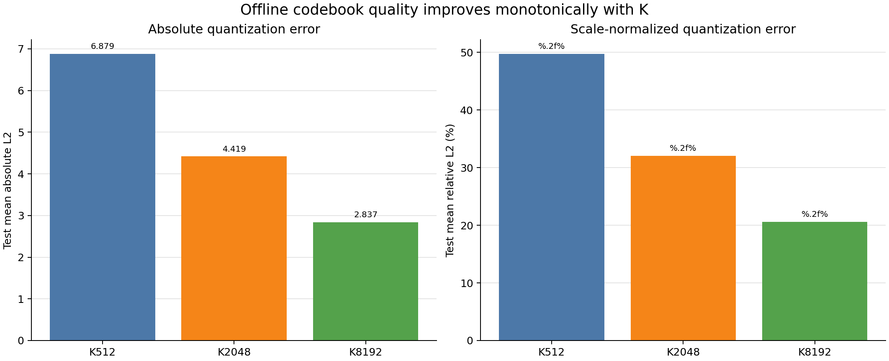
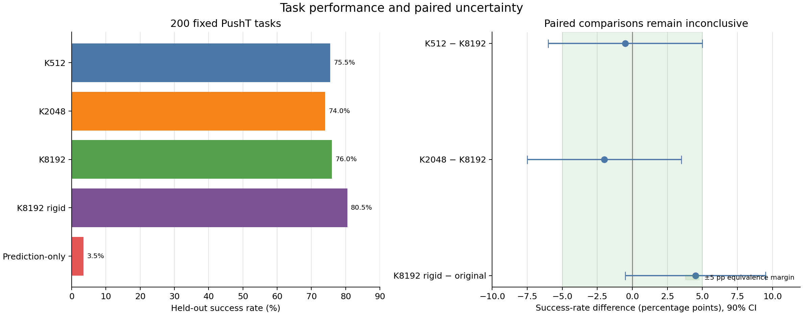
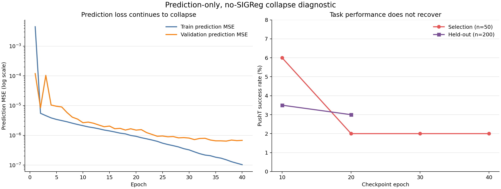

# 码本质量与 K8192 刚体变换实验报告

> 实验状态：已完成 seed3072 受控主实验及无码本、无 SIGReg 的 prediction-only 附加消融；结论限于单一训练 seed  
> 训练 seeds：[3072]  
> 主要指标：200 个固定 held-out PushT 任务成功率

## 1. 码本量化质量

| 条件 | 测试绝对 L2 | 测试相对 L2 |
|---|---:|---:|
| k512_original | 6.8794 | 49.73% |
| k2048_original | 4.4187 | 32.04% |
| k8192_original | 2.8373 | 20.62% |

离线量化误差随 K 增大单调下降；但这一排序没有直接转化为同幅度的 held-out PushT 成功率差异。

## 2. Held-out 任务结果

| 条件 | Seed 3072 | 均值 ± 标准差 |
|---|---:|---:|
| k512_original | 75.50% | 75.50% ± 0.00 |
| k2048_original | 74.00% | 74.00% ± 0.00 |
| k8192_original | 76.00% | 76.00% ± 0.00 |
| k8192_rigid | 80.50% | 80.50% ± 0.00 |
| prediction_only_no_sigreg（selection 选中 epoch 10） | 3.50% | 3.50% ± 0.00 |

## 3. 配对差值与实践等价性

| 比较（左−右） | 差值 | 90% CI | 95% CI | Holm p | 判定 |
|---|---:|---:|---:|---:|---|
| k512_original − k8192_original | -0.50pp | [-6.00, +5.00] | [-7.00, +6.00] | 1 | inconclusive |
| k2048_original − k8192_original | -2.00pp | [-7.50, +3.50] | [-8.50, +4.50] | 1 | inconclusive |
| k8192_rigid − k8192_original | +4.50pp | [-0.50, +9.50] | [-1.50, +10.50] | 0.5632 | inconclusive |

左图显示码本条件的点估计集中在 74%–80.5%，prediction-only 则只有 3.5%；右图中三个码本主比较的 90% 区间均未给出实践等价或显著差异的充分证据。

## 4. K8192 刚体变换审计

- 变换模式：rigid
- 旋转 determinant：1.00000003
- 正交最大误差：2.108e-08
- 平移长度：13.923180
- Top-1 token 一致率：100.0000%
- Top-32 有序一致率：99.8047%

## 5. 异常诊断决策

- Seed3072 rigid/original 差值为 4.50pp，未超过 5.0pp，因此未运行额外诊断条件。

## 6. 无码本、无 SIGReg 的 prediction-only 消融

### 6.1 实验设置

该附加消融使用官方 `galilai-group/lewm-pusht` 数据从头训练原生 LeWM，训练 seed 为 3072。模型不加载或访问码本，不使用连续 teacher latent MSE、hard token、soft-KL 或其他 teacher 蒸馏目标，同时将 SIGReg 完全关闭；唯一优化目标为下一时刻 latent 的 prediction MSE。

主要训练配置如下：

- 40 epochs，BF16，单张 A100 GPU0；
- batch size 128，10 个 DataLoader workers；
- AdamW、学习率和模型结构沿用官方 PushT LeWM 配置；
- 保存 epoch 10、20、30、40 四个部署权重；
- 训练于 2026-08-28 19:40 UTC 正常结束，停止原因为 `max_epochs=40 reached`；
- 训练配置：`scripts/train/config/lewm_prediction_only_ablation.yaml`；
- 权重目录：`.stablewm/checkpoints/ablations/lewm_pusht_prediction_only_seed3072_40ep`；
- 评测目录：`.stablewm/experiments/lewm_pusht_prediction_only_seed3072_40ep`。

### 6.2 Checkpoint 选择与结果

四个 checkpoint 使用与码本实验相同的 50 个 selection 起点评测。按 selection 成功率选择 checkpoint；epoch 10 以 6.0% 胜出，因此仅将 epoch 10 作为正式选中 checkpoint 汇总到 held-out 主表。

| Checkpoint | Selection 成功数 | Selection 成功率 | Held-out 结果 | 用途 |
|---|---:|---:|---:|---|
| epoch 10 | 3/50 | 6.0% | 7/200（3.5%） | 正式选中 checkpoint |
| epoch 20 | 1/50 | 2.0% | 6/200（3.0%） | 参与 selection；held-out 仅作中期诊断 |
| epoch 30 | 1/50 | 2.0% | 未评测 | selection-only |
| epoch 40 | 1/50 | 2.0% | 未评测 | final，selection-only |

epoch 40 的训练 prediction MSE 为 `9.369e-08`，验证 prediction MSE 为 `6.768e-07`，但 selection 成功率仍只有 2.0%。因此 prediction MSE 持续降低并未转化为任务能力，且延长到 40 epochs 没有恢复性能。

损失曲线与任务曲线呈现明显脱钩：prediction MSE 继续下降多个数量级，而 selection/held-out 成功率始终接近零。这与表征坍塌诊断一致，但仍不能单独区分“移除码本监督”和“关闭 SIGReg”各自的贡献。

### 6.3 与码本模型的配对比较

以下差值均为“prediction-only 选中模型 − 码本模型”，使用相同的 200 个 held-out 起点。置信区间采用配对 bootstrap；Holm 校正在本节四个比较内进行。

| 比较 | 差值 | 90% 配对 CI | Holm p | 判定 |
|---|---:|---:|---:|---|
| prediction-only − k512_original | -72.0pp | [-77.0, -66.5] | 1.794e-43 | 显著更差 |
| prediction-only − k2048_original | -70.5pp | [-75.5, -65.0] | 7.175e-43 | 显著更差 |
| prediction-only − k8192_original | -72.5pp | [-77.5, -67.0] | 1.345e-43 | 显著更差 |
| prediction-only − k8192_rigid | -77.0pp | [-82.0, -72.0] | 1.375e-44 | 显著更差 |

prediction-only 自身的 200-task 成功率为 3.5%，任务 bootstrap 90% 区间为 `[1.5%, 6.0%]`。它与所有码本条件的差值区间均完全位于 -5pp 以下，明确不满足实践等价标准。

### 6.4 解释边界

该结果表明“仅靠 prediction MSE 从头训练”不足以学习可用于 PushT 规划的表示。极低的 prediction MSE 与极低的成功率同时出现，符合 encoder/predictor 通过近常量 latent 降低损失的表征坍塌现象。

但该消融同时移除了两类约束：码本/teacher 蒸馏目标和 SIGReg 防坍塌正则。因此，3.5% 的结果不能单独证明“冻结码本本身贡献了约 70 个百分点”，只能证明当前 prediction-only 目标缺少必要的表示锚点。

作为辅助诊断，仓库中已有的无码本、保留官方 SIGReg 的 scratch epoch-10 模型，在完全相同的 50 个 selection 起点上达到 88.0%；该结果尚未按本报告协议完成配对 200-task held-out 评测，所以不纳入主表和正式统计。它提示性能下降更可能来自关闭所有防坍塌/teacher 约束，而不能直接归因于缺少冻结码本。若要单独测量码本贡献，应进一步运行“无码本 + SIGReg”的正式 held-out 对照，或保留连续 teacher latent MSE、仅移除离散码本/soft-KL 的对照。

## 7. 结论

码本质量主实验中，K512、K2048 与 K8192-original 的差异仍为证据不足，不能宣称实践等价；K8192-rigid 与原始 K8192 的 +4.5pp 差值也没有达到预注册诊断阈值。

附加 prediction-only 消融在选中 epoch 10 上仅达到 3.5% held-out 成功率，显著低于全部码本条件，并在继续训练到 epoch 40 后仍未恢复。这证明无 SIGReg、无 teacher/码本约束的纯预测目标会失败，但不能把失败唯一归因于冻结码本缺失。

最终结论以本报告的 held-out 成功率、配对置信区间和预注册 ±5pp 实践等价标准为准。当前所有训练结论仍只覆盖 seed3072，不能外推为正式多-seed 结论。
