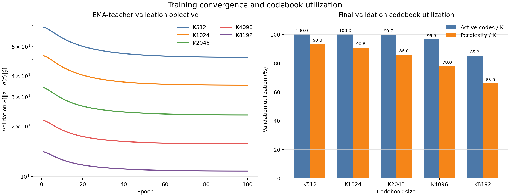
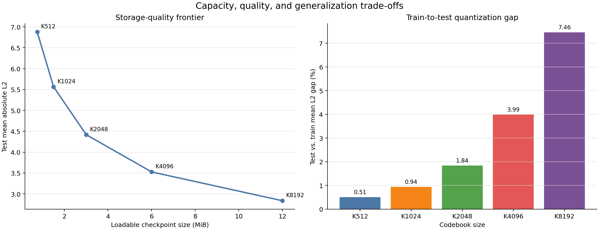

# K512–K8192 离散码本质量对比实验报告

> 实验状态：五组码本均已完成 100 epochs 训练与独立测试集量化评估  
> 报告日期：2026-08-29  
> 项目：Stable World Model / LeWM PushT  
> 对比范围：K512、K1024、K2048、K4096、K8192  
> 核心结论：若只追求离线量化保真度，选择 **K8192**；若同时考虑容量、覆盖率和存储开销，**K4096** 是更均衡的候选

## 1. 摘要

本报告对同一官方 LeWM PushT 连续隐空间训练得到的五组离散码本进行统一比较。五组实验除码本大小外，其余数据、encoder、latent 维度、随机种子、初始化样本数、优化器和训练轮数均保持一致。

独立测试集上的主要结果如下：

- 平均绝对 L2 量化误差随码本增大单调下降：从 K512 的 **6.8794** 降至 K8192 的 **2.8373**，下降 **58.76%**。
- 平均相对 L2 误差从 **49.73%** 降至 **20.62%**，下降 **58.54%**。
- 测试误差 P99 从 **11.5188** 降至 **7.3097**，下降 **36.54%**；大码本不仅改善均值，也改善长尾样本。
- 每次将 K 翻倍，测试平均绝对 L2 均继续下降约 **19%–21%**；在 K512–K8192 范围内没有出现误差反弹。
- 代价是权重体积按 K 线性增长：可加载 checkpoint 从 **0.752 MiB** 增至 **12.002 MiB**，扩大约 16 倍。
- 验证集 active-code fraction 从 K512/K1024 的 **100%** 降至 K8192 的 **85.21%**；perplexity/K 从 **93.32%** 降至 **65.91%**，说明大码本的新增容量未被均匀使用。
- 所有实验的最优验证目标都出现在 epoch 100，但 epoch 90 到 100 的相对改善均小于 **0.08%**，训练在后十轮已基本进入平台期。

因此，结论取决于使用目标：

1. **最高离线量化保真度：K8192。** 它在均值、分位数和相对误差上均为最佳。
2. **容量与质量折中：K4096。** 它相对 K512 将测试平均误差降低 48.73%，验证 active-code fraction 仍有 96.48%，而权重体积只有 K8192 的一半。
3. **更紧凑的部署：K2048。** 其 checkpoint 约 3.002 MiB，验证 active-code fraction 为 99.71%，测试平均误差比 K512 低 35.77%。
4. **不能仅凭本报告确定闭环任务最优 K。** 本目录评估的是静态 latent 量化质量，不是 PushT 规划成功率；五个 K 仍需在完全相同的闭环协议下评测。

## 2. 实验目标与比较边界

### 2.1 实验目标

本次比较回答三个问题：

1. 增大码本大小是否持续降低官方 LeWM latent 的最近邻量化误差？
2. 更大码本是否仍能保持充分的码字覆盖和较均匀的使用分布？
3. 量化质量提升相对于 checkpoint 存储增长是否值得？

### 2.2 结果边界

`.stablewm/codebook_runs` 中五组结果包含：

- 码本训练曲线与最终验证指标；
- train、validation、独立 test 三个 split 的逐向量量化误差统计；
- EMA teacher 码本权重和码字使用统计；
- 各 split 的误差分布图。

这些结果不包含五个 K 的统一 PushT 闭环规划评测。因此，本报告中的“质量”特指 **连续 latent 的离线最近邻重建质量与码本使用效率**，不等同于最终任务成功率。

## 3. 受控实验设置

### 3.1 共同配置

| 项目 | 统一设置 |
|---|---:|
| 冻结 encoder | `official_lewm_pusht_compat` |
| 数据集 | `galilai-group/lewm-pusht` |
| 原数据集长度 | 2,336,736 |
| 抽取 latent 总数 | 262,144 |
| 训练 latent | 235,929 |
| 验证 latent | 26,215 |
| 独立测试 latent | 32,768 |
| latent 维度 | 192 |
| 图像大小 | 224 × 224 |
| 训练 seed | 3072 |
| k-means++ 初始化样本 | 65,536 |
| EMA teacher momentum | 0.99 |
| epochs | 100 |
| batch size | 8,192 |
| 初始 / 最小学习率 | 1e-3 / 1e-5 |
| weight decay | 0 |
| 量化权重 | `teacher.weight`（EMA teacher） |

五组实验唯一的核心自变量是 `num_embeddings`：512、1024、2048、4096、8192。每个 checkpoint 同时保存 FP32 `student.weight` 和 `teacher.weight`，两者形状均为 `[K, 192]`。

### 3.2 指标定义

对连续 latent `z` 及其最近邻 EMA-teacher 码字 `q(z)`：

```text
absolute_l2 = ||z - q(z)||₂
relative_l2 = ||z - q(z)||₂ / max(||z||₂, 1e-12)
val_teacher_l2 = E[||z - q(z)||₂²]
perplexity = exp(-Σ p(code) log p(code))
```

其中：

- `absolute_l2` 和 `relative_l2` 是逐向量误差，本报告以独立 test split 为主。
- `val_teacher_l2` 是验证集平均平方 L2，用于选择 checkpoint；它不是测试集平均绝对 L2 的平方。
- `active-code fraction` 只判断某个码字是否至少被使用一次。
- `perplexity/K` 同时反映覆盖和使用均匀性；数值越接近 100%，表示有效使用越接近完整且均匀的 K 个码字。

## 4. 测试集量化质量

### 4.1 核心结果

| 码本 | 绝对 L2 均值 | 中位数 | P90 | P99 | 相对 L2 均值 | 相对 K512 均值改善 |
|---:|---:|---:|---:|---:|---:|---:|
| K512 | 6.8794 | 6.8719 | 9.6591 | 11.5188 | 49.73% | — |
| K1024 | 5.5670 | 5.4675 | 8.3582 | 10.3377 | 40.30% | 19.08% |
| K2048 | 4.4187 | 4.2637 | 7.1408 | 9.2285 | 32.04% | 35.77% |
| K4096 | 3.5271 | 3.3181 | 6.0913 | 8.2655 | 25.59% | 48.73% |
| K8192 | **2.8373** | **2.5788** | **5.1929** | **7.3097** | **20.62%** | **58.76%** |


结果具有稳定的单调性：K 越大，均值、中位数、P90 和 P99 均越低。平均绝对 L2 的相邻翻倍收益为：

| 扩容 | 平均绝对 L2 降幅 | 绝对下降量 |
|---|---:|---:|
| K512 → K1024 | 19.08% | 1.3124 |
| K1024 → K2048 | 20.63% | 1.1483 |
| K2048 → K4096 | 20.18% | 0.8916 |
| K4096 → K8192 | 19.56% | 0.6898 |

相对降幅大致稳定在 20%，但绝对下降量逐级缩小。这一范围内的经验关系近似为 `mean absolute L2 ∝ K^-0.32`，可作为当前数据上的插值描述，不应直接外推到更大的码本。

### 4.2 长尾误差

K8192 的 P99 仍为 7.3097，明显高于其中位数 2.5788，说明少量 latent 仍较难量化。但与 K512 相比：

- 中位数下降 62.47%；
- P90 下降 46.24%；
- P99 下降 36.54%。

均值的改善快于长尾改善，说明增大 K 对典型 latent 的收益更明显，而高误差样本仍可能需要更有针对性的码本训练、分层码本或残差量化。

## 5. 码本覆盖率与使用均匀性

| 码本 | 验证 perplexity | Perplexity / K | Active codes | Active fraction | 未激活码字 | 最大单码占比 |
|---:|---:|---:|---:|---:|---:|---:|
| K512 | 477.81 | **93.32%** | 512 | **100.00%** | 0 | 0.5493% |
| K1024 | 929.87 | 90.81% | 1,024 | **100.00%** | 0 | 0.2975% |
| K2048 | 1,760.29 | 85.95% | 2,042 | 99.71% | 6 | 0.1678% |
| K4096 | 3,195.10 | 78.01% | 3,952 | 96.48% | 144 | 0.1144% |
| K8192 | **5,399.03** | 65.91% | **6,980** | 85.21% | 1,212 | **0.0916%** |



需要区分绝对量和归一化效率：

- K8192 的有效码字绝对数量最高，perplexity 也是最高的，因此它确实表达了更多离散状态。
- 但 K8192 有 1,212 个码字未在 26,215 个验证 latent 中出现，且 perplexity 只相当于 K 的 65.91%。
- 最大单码占比随 K 增大持续下降，没有出现少数单码占据大量样本的严重热点坍塌。
- 覆盖率下降主要表现为长尾码字稀疏或未激活，而不是头部码字异常集中。

因此，K8192 不是“码本坍塌”，但其边际容量利用效率明显低于 K512–K2048。对验证样本量有限的场景，active fraction 也会受 split 大小影响，应结合 perplexity/K 解读。

## 6. 泛化与训练收敛

### 6.1 Train–validation–test 误差

| 码本 | Train 平均绝对 L2 | Validation | Test | Test 相对 Train 增幅 |
|---:|---:|---:|---:|---:|
| K512 | 6.8444 | 6.8773 | 6.8794 | 0.51% |
| K1024 | 5.5150 | 5.5709 | 5.5670 | 0.94% |
| K2048 | 4.3387 | 4.4163 | 4.4187 | 1.84% |
| K4096 | 3.3918 | 3.5128 | 3.5271 | 3.99% |
| K8192 | 2.6404 | 2.8431 | 2.8373 | 7.46% |



所有码本的验证与测试结果接近，说明独立 test split 没有出现异常偏移。与此同时，K 越大，test 相对 train 的误差增幅越明显，从 0.51% 增至 7.46%。这表明更大码本对训练 latent 的局部拟合更充分，也带来更大的 train–test gap；但 K8192 的测试绝对误差仍然是五组中最低，因此该 gap 尚未抵消其容量收益。

### 6.2 收敛速度

| 码本 | Epoch 1 验证平方 L2 | Epoch 50 | Epoch 90 | Epoch 100 | Epoch 90→100 改善 |
|---:|---:|---:|---:|---:|---:|
| K512 | 78.2206 | 53.2446 | 51.6932 | 51.6536 | 0.0766% |
| K1024 | 52.8308 | 36.0447 | 35.1897 | 35.1670 | 0.0646% |
| K2048 | 34.0202 | 23.8934 | 23.3417 | 23.3270 | 0.0630% |
| K4096 | 21.6557 | 15.9572 | 15.6742 | 15.6674 | 0.0436% |
| K8192 | 14.0589 | 10.9441 | 10.7726 | 10.7681 | 0.0414% |

五组 `best_epoch` 均为 100，训练目标在完整训练过程中仍保持微弱改善。不过，最后十轮的收益都低于 0.08%。如果后续需要大量扫描 K、seed 或其他超参数，可以把 90 epochs 作为节省算力的候选停止点；在正式替代 100 epochs 前，仍应验证 task-level 指标不会受影响。

## 7. 存储成本与选择建议

| 码本 | `weights.pt` | 相对 K512 体积 | 测试平均绝对 L2 | 验证 active fraction |
|---:|---:|---:|---:|---:|
| K512 | 0.752 MiB | 1× | 6.8794 | 100.00% |
| K1024 | 1.502 MiB | 2× | 5.5670 | 100.00% |
| K2048 | 3.002 MiB | 4× | 4.4187 | 99.71% |
| K4096 | 6.002 MiB | 8× | 3.5271 | 96.48% |
| K8192 | 12.002 MiB | 16× | **2.8373** | 85.21% |

建议按目标选择：

| 使用目标 | 建议码本 | 依据 |
|---|---:|---|
| 最低离线量化误差 | **K8192** | 所有测试误差统计最佳，平均误差比 K512 低 58.76% |
| 质量、覆盖率、存储折中 | **K4096** | 6.002 MiB、96.48% active，平均误差已比 K512 低 48.73% |
| 紧凑且保持高覆盖 | **K2048** | 3.002 MiB、99.71% active，平均误差比 K512 低 35.77% |
| 最小 checkpoint / 快速基线 | K512 | 0.752 MiB、100% active，但量化误差最高 |

上述建议只针对离线量化质量。仓库现有的 [码本质量与刚体变换实验报告](codebook_quality_and_rigid_transform_experiment_report.md) 已对 K512、K2048、K8192 做过单 seed 的 200-task held-out 评测，三者成功率差异仍为证据不足；K1024 和 K4096 尚无同口径结果。因此，在部署选择前仍应补齐五个 K 的统一多-seed 闭环任务评测。

## 8. 原始误差分布图

以下图片均由各 run 的 `quantization_errors.npz` 生成，分别展示 train、validation、test 的绝对与相对量化误差分布。

### 8.1 K512


### 8.2 K1024


### 8.3 K2048


### 8.4 K4096


### 8.5 K8192


## 9. 原始结果索引与复现

| 码本 | 配置 | 训练指标 | 量化评估 | 汇总 | 可加载权重 |
|---:|---|---|---|---|---|
| K512 | [config](../.stablewm/codebook_runs/official_lewm_pusht_compat_codebook/config.yaml) | [metrics.csv](../.stablewm/codebook_runs/official_lewm_pusht_compat_codebook/metrics.csv) | [JSON](../.stablewm/codebook_runs/official_lewm_pusht_compat_codebook/quantization_evaluation.json) | [summary](../.stablewm/codebook_runs/official_lewm_pusht_compat_codebook/summary.json) | [weights](../.stablewm/checkpoints/official_lewm_pusht_compat_codebook/weights.pt) |
| K1024 | [config](../.stablewm/codebook_runs/official_lewm_pusht_compat_codebook_k1024/config.yaml) | [metrics.csv](../.stablewm/codebook_runs/official_lewm_pusht_compat_codebook_k1024/metrics.csv) | [JSON](../.stablewm/codebook_runs/official_lewm_pusht_compat_codebook_k1024/quantization_evaluation.json) | [summary](../.stablewm/codebook_runs/official_lewm_pusht_compat_codebook_k1024/summary.json) | [weights](../.stablewm/checkpoints/official_lewm_pusht_compat_codebook_k1024/weights.pt) |
| K2048 | [config](../.stablewm/codebook_runs/official_lewm_pusht_compat_codebook_k2048/config.yaml) | [metrics.csv](../.stablewm/codebook_runs/official_lewm_pusht_compat_codebook_k2048/metrics.csv) | [JSON](../.stablewm/codebook_runs/official_lewm_pusht_compat_codebook_k2048/quantization_evaluation.json) | [summary](../.stablewm/codebook_runs/official_lewm_pusht_compat_codebook_k2048/summary.json) | [weights](../.stablewm/checkpoints/official_lewm_pusht_compat_codebook_k2048/weights.pt) |
| K4096 | [config](../.stablewm/codebook_runs/official_lewm_pusht_compat_codebook_k4096/config.yaml) | [metrics.csv](../.stablewm/codebook_runs/official_lewm_pusht_compat_codebook_k4096/metrics.csv) | [JSON](../.stablewm/codebook_runs/official_lewm_pusht_compat_codebook_k4096/quantization_evaluation.json) | [summary](../.stablewm/codebook_runs/official_lewm_pusht_compat_codebook_k4096/summary.json) | [weights](../.stablewm/checkpoints/official_lewm_pusht_compat_codebook_k4096/weights.pt) |
| K8192 | [config](../.stablewm/codebook_runs/official_lewm_pusht_compat_codebook_k8192/config.yaml) | [metrics.csv](../.stablewm/codebook_runs/official_lewm_pusht_compat_codebook_k8192/metrics.csv) | [JSON](../.stablewm/codebook_runs/official_lewm_pusht_compat_codebook_k8192/quantization_evaluation.json) | [summary](../.stablewm/codebook_runs/official_lewm_pusht_compat_codebook_k8192/summary.json) | [weights](../.stablewm/checkpoints/official_lewm_pusht_compat_codebook_k8192/weights.pt) |

重建本文三张横向对比图：

```bash
source activate swm-env
python scripts/train/plot_codebook_size_comparison.py
```

绘图脚本：[plot_codebook_size_comparison.py](../scripts/train/plot_codebook_size_comparison.py)

## 10. 最终结论与后续建议

1. **K8192 是明确的离线量化质量赢家。** 它在 test mean、median、P90、P99 和 relative L2 上全部最优。
2. **K4096 是当前更均衡的工程候选。** 相比 K8192，它将 checkpoint 体积减半，并保持 96.48% 的验证码字激活率；代价是测试平均绝对 L2 从 2.8373 增至 3.5271。
3. **大码本的容量利用率存在递减。** K8192 虽使用了更多绝对码字，但 perplexity/K 只有 65.91%，且 train–test gap 增至 7.46%。
4. **100 epochs 已接近充分收敛。** 所有 K 在最后十轮的验证目标改善都低于 0.08%；后续大规模扫描可评估 90 epochs 早停。
5. **下一步应补齐任务评测。** 对五个 K 使用相同起点、相同随机种子、相同 checkpoint 选择协议和多个训练 seed，报告配对置信区间；在此之前，不应把量化误差排序直接解释为 PushT 成功率排序。
