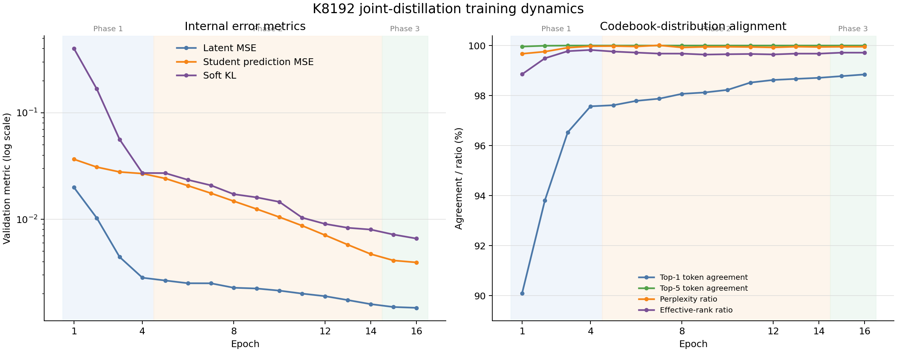

# K8192 离散码本与连续隐空间联合蒸馏实验报告

> 实验状态：已完成并通过自动评估<br>
> 报告日期：2026-08-26<br>
> 项目：Stable World Model / LeWM PushT<br>
> 最终推荐：使用 Phase 2 可部署权重，固定评测成功率为 **78%（39/50）**

## 1. 摘要

本实验围绕已有官方 LeWM 编码器的连续隐空间和已提取的 K8192 离散码本，回答两个问题：

1. 不重新训练官方模型，仅把官方编码器输出的 latent 映射到最近码本向量后再交给官方 predictor rollout，任务成功率是多少？
2. 采用码本监督进行连续隐空间联合蒸馏后，新模型的任务成功率和收敛速度相对 baseline 如何？

在完全固定 Python、NumPy、PyTorch、CUDA 和 CEM 随机种子后，50 个相同 PushT 起点上的结果如下：

- 官方连续模型：**90%（45/50）**。
- 官方 encoder latent 量化后输入 predictor：**58%（29/50）**，相对官方连续模型下降 32 个百分点。
- 每一步预测 latent 也重新量化：**24%（12/50）**，相对官方连续模型下降 66 个百分点。
- Scratch baseline epoch 10：**88%（44/50）**。
- 新联合蒸馏方案：Phase 1 为 38%，Phase 2 为 **78%**，Final 为 76%。

核心结论是：官方 predictor 对连续 latent 分布存在明显依赖，不能在推理时无代价地强制插入离散码本。联合训练把最佳成功率从直接强制离散化的 58% 提升到 78%，但仍低于官方连续模型和 scratch baseline。任务指标在 Phase 2 达到峰值，Phase 3 的内部蒸馏指标继续改善，但任务成功率没有同步提升。

## 2. 实验目标与范围

### 2.1 保留内容

- 官方 LeWM baseline 模型及其权重。
- Scratch baseline 及其权重。
- 从官方编码器连续隐空间提取的 K8192 码本。
- 当前连续隐空间联合蒸馏训练和部署代码。

### 2.2 不再使用的旧逻辑

旧的离散世界模型训练逻辑不再参与当前方案。码本仅用于：

- 生成离线 teacher/cache 监督；
- 训练期间衡量 token agreement、perplexity 等对齐指标；
- 本报告中的“官方模型强制离散化”对照实验。

联合蒸馏模型的部署权重不包含 teacher、cache 或 codebook，部署阶段只保留 encoder、projector、adapter、action encoder、predictor 和 prediction projector。

## 3. 实验设计

### 3.1 模型与量化变体

| 名称 | Encoder 输出 | Predictor rollout | 是否重新训练 |
|---|---|---|---:|
| 官方连续模型 | 连续 latent | 连续 autoregressive rollout | 否 |
| 官方 K8192 encoder-only | 初始观测和目标 latent 映射到最近码本向量 | 后续预测保持连续 | 否 |
| 官方 K8192 recurrent | 初始 latent 离散化 | 每一步预测后再次映射到最近码本向量 | 否 |
| Scratch baseline | 连续 latent | 连续 rollout | 是 |
| 新联合蒸馏模型 | 学习匹配码本所表达的连续 latent | predictor 与 encoder 联合适配 | 是 |

Encoder-only 量化对应用户指定的主实验：

```text
图像 x
  -> 官方 encoder 得到 z
  -> q(z) = 最近的 K8192 码本向量
  -> 官方 predictor rollout
```

严格 recurrent 量化是额外压力测试：

```text
q(z_t), action_t
  -> 官方 predictor 得到 z_(t+1)
  -> q(z_(t+1))
  -> 下一步 rollout
```

### 3.2 码本

| 项目 | 值 |
|---|---:|
| 码本大小 | 8192 |
| 向量维度 | 192 |
| 权重键 | `teacher.weight` |
| 最近邻距离 | 精确平方欧氏距离 |
| 距离计算 chunk size | 2048 |
| SHA-256 | `08e33f16397282a379d8d0b95d5b11be8d477885494272dd7065d72e9f575072` |

训练完成后的码本哈希与训练清单完全一致，确认码本在训练及评估期间未被修改。

下图展示 K8192 EMA-teacher 码本在 train、validation 和独立 test split 上的逐向量绝对/相对 L2 误差分布。三组分布整体接近，独立测试集没有出现异常偏移。


### 3.3 训练配置

| 项目 | 值 |
|---|---:|
| 训练 seed | 3072 |
| GPU | GPU 1、2、3，共 3 张 NVIDIA A100-SXM4-80GB |
| DDP world size | 3 |
| CPU workers | 50 |
| 每 GPU batch size | 256 |
| 全局 batch size | 768 |
| 精度 | BF16 mixed precision |
| Phase epochs | `[4, 10, 2]`，共 16 epochs |
| Optimizer | AdamW |
| Codebook top-k teacher support | 32 |
| 数据集 | `galilai-group/lewm-pusht` |

训练分为三阶段：

- Phase 1：4 epochs，teacher forcing alpha 固定为 0，优先建立 latent/codebook 对齐。
- Phase 2：10 epochs，逐步把 teacher forcing alpha 从 0 提升到 1。
- Phase 3：2 epochs，alpha 固定为 1，以较小学习率微调。

## 4. 固定评测协议

所有正式数字均使用同一协议：

| 项目 | 值 |
|---|---:|
| 环境 | `swm/PushT-v1` |
| 评测数据 | `galilai-group/lewm-pusht` |
| 评测数量 | 50 |
| 评测 seed | 42 |
| RNG 范围 | Python、NumPy、PyTorch、CUDA |
| Planner | CEM |
| Planning horizon | 5 |
| Receding horizon | 5 |
| Action block | 5 |
| Goal offset | 25 steps |
| Evaluation budget | 50 steps |
| 图像大小 | 224 × 224 |

此前评估入口只用 seed 固定了 50 个数据起点，没有固定 PyTorch/CUDA 的 CEM 采样。本实验已修复该问题；报告仅采用修复后重新运行的数字。每个成功或失败样本对应 2 个百分点，因此 Phase 2 与 Final 的 2 个百分点差异仅相当于一个任务。

## 5. 任务成功率结果


### 5.1 官方模型强制离散化

| 模型 | 成功数 | 成功率 | 相对官方连续模型 | 评测耗时（秒） |
|---|---:|---:|---:|---:|
| 官方连续模型 | 45/50 | **90%** | 0 | 52.595 |
| 官方 K8192 encoder-only | 29/50 | **58%** | -32 个百分点 | 64.074 |
| 官方 K8192 recurrent | 12/50 | **24%** | -66 个百分点 | 81.090 |

区别在于：**是否把 predictor 每一步预测出来的 latent 再次离散化。**

| 方案 | Rollout 过程 | 成功率 |
|---|---|---:|
| K8192 encoder-only | 只离散化 encoder 输出的初始观测/目标 latent；predictor 后续一直在连续空间 rollout | 58% |
| K8192 recurrent | 不仅离散化初始 latent，而且每一步预测结果都重新匹配最近码本，再输入下一步 predictor | 24% |

具体流程：

```text
encoder-only：

图像 → encoder → 连续 z₀ → 最近码本 q(z₀)
                         ↓
predictor → 连续 z₁ → predictor → 连续 z₂ → predictor → ...
```

```text
recurrent：

图像 → encoder → 连续 z₀ → 最近码本 q(z₀)
                         ↓
predictor → z₁ → q(z₁) → predictor → z₂ → q(z₂) → ...
```

为什么 recurrent 更差：

- 每次最近邻量化都会丢掉码本向量之间的连续残差信息。
- predictor 原本是在连续 latent 上训练的，预测结果不一定位于码本向量附近。
- 每一步都强制吸附到码本，相当于反复引入量化误差。
- rollout 越长，误差和错误码本选择越容易累积。
- 同时每一步都需要搜索 8192 个码，评估耗时也从 64.074 秒增加到 81.090 秒。

所以，**58% 对应你最初描述的方案**：“官方编码器输出的 latent 离散化后输入 predictor rollout”。

24% 是更严格的纯离散递归实验，说明如果想让整个 rollout 始终处在离散码本上，就必须在训练 predictor 时加入逐步量化，而不能只在推理阶段强制执行。

原始结果：

- [官方连续模型结果](../.stablewm/checkpoints/official_lewm_pusht_compat/pusht_results_official_seeded_50.txt)
- [官方 K8192 encoder-only 结果](../.stablewm/checkpoints/official_lewm_pusht_compat_codebook_k8192_encoder_only/pusht_results_official_k8192_encoder_only_seeded_50.txt)
- [官方 K8192 recurrent 结果](../.stablewm/checkpoints/official_lewm_pusht_compat_codebook_k8192_recurrent/pusht_results_official_k8192_recurrent_seeded_50.txt)

Encoder-only 量化使评测耗时相对官方连续模型增加约 22%；recurrent 量化增加约 54%。这部分开销来自 rollout 中的 K8192 精确最近邻搜索，尤其是 recurrent 方案需要在每个预测步重复搜索。

### 5.2 新联合蒸馏方案与 baseline

| 模型/阶段 | Epoch | 成功数 | 成功率 | 相对官方连续模型 | 相对 scratch epoch 10 |
|---|---:|---:|---:|---:|---:|
| 官方连续模型 | — | 45/50 | **90%** | 0 | +2 个百分点 |
| Scratch baseline | 10 | 44/50 | **88%** | -2 个百分点 | 0 |
| 新方案 Phase 1 | 4 | 19/50 | **38%** | -52 个百分点 | -50 个百分点 |
| 新方案 Phase 2 | 14 | 39/50 | **78%** | -12 个百分点 | -10 个百分点 |
| 新方案 Final | 16 | 38/50 | **76%** | -14 个百分点 | -12 个百分点 |


图中可直观看到：recurrent 强制量化损失最大；联合蒸馏 Phase 2 明显恢复任务能力，但仍未追平官方连续模型或 scratch baseline。

原始结果与汇总：

- [Scratch epoch-10 结果](../.stablewm/checkpoints/lewm_scratch_baseline_seed3072/pusht_results_scratch_epoch10_seeded_50.txt)
- [Phase 1 结果](../.stablewm/joint_distillation/lewm_pusht_k8192_seed3072/task_evaluation/phase1/pusht_results_phase1_50.txt)
- [Phase 2 结果](../.stablewm/joint_distillation/lewm_pusht_k8192_seed3072/task_evaluation/phase2/pusht_results_phase2_50.txt)
- [Final 结果](../.stablewm/joint_distillation/lewm_pusht_k8192_seed3072/task_evaluation/final/pusht_results_final_50.txt)
- [自动评估汇总](../.stablewm/joint_distillation/lewm_pusht_k8192_seed3072/task_evaluation/summary.json)

### 5.3 收敛速度判断

- Phase 1 在 epoch 4 仅达到 38%，说明仅完成 latent 对齐尚不足以获得可用的长程任务能力。
- Phase 2 在 epoch 14 达到 78%，相比 Phase 1 提升 40 个百分点，是主要任务能力形成阶段。
- Final 在 epoch 16 为 76%，没有超过 Phase 2。
- Scratch baseline 在 epoch 10 已达到 88%，因此新方案相对 scratch baseline 收敛更慢，最终上限也更低。
- Phase 2 比直接强制官方 encoder-only 离散化高 20 个百分点，说明联合适配 predictor 是有效的。

## 6. 内部蒸馏指标

| Epoch | Phase | Alpha | Latent MSE | Token agreement | Perplexity ratio | Student prediction MSE | Active codes |
|---:|---:|---:|---:|---:|---:|---:|---:|
| 1 | 1 | 0.0 | 0.019912 | 90.10% | 0.996724 | 0.036600 | 8188 |
| 4 | 1 | 0.0 | 0.002826 | 97.57% | 0.999718 | 0.026850 | 8190 |
| 14 | 2 | 1.0 | 0.001596 | 98.71% | 0.999431 | 0.004716 | 8190 |
| 16 | 3 | 1.0 | **0.001474** | **98.84%** | **0.999529** | **0.003935** | 8190 |



三阶段训练中，latent MSE、student prediction MSE 和 soft KL 持续下降，token agreement 逐步接近 100%。这也突出显示了内部指标和闭环任务指标之间的差异：epoch 16 的内部指标优于 epoch 14，但任务成功率没有同步提高。

Final 内部质量门全部通过：

- `requirements_met = true`
- Top-5 token agreement：100%
- Student/teacher effective-rank ratio：0.997150
- Student/teacher perplexity ratio：0.999529

[完整 Final 内部评估](../.stablewm/joint_distillation/lewm_pusht_k8192_seed3072/final_evaluation.json)

内部指标从 epoch 14 到 epoch 16 继续改善，但任务成功率由 78% 变为 76%。这说明 latent/token 级别的拟合指标不能替代真实闭环任务评估；模型选择必须以 PushT 成功率为主要指标。

## 7. 结果分析

### 7.1 官方模型为何不能直接强制离散化

官方 predictor 是在连续 latent 分布上训练的。Encoder-only 方案把输入投影到有限码本向量后，虽然每个向量都接近原 latent，但 predictor 接收到的分布已经改变。多步 rollout 会放大这种初始偏移，因此成功率从 90% 降到 58%。

### 7.2 为何 recurrent 量化进一步下降

Recurrent 方案在每一步预测后再次取最近码本向量。每一步都会丢弃码本单元内部的连续残差，并把小误差变成离散选择变化。该误差在 autoregressive rollout 中累积，最终成功率只有 24%。因此，如果目标是严格离散 rollout，必须在训练阶段显式加入 recurrent quantization，而不能只在已训练好的连续 predictor 外部增加最近邻操作。

### 7.3 联合蒸馏有效但尚未追平 baseline

联合蒸馏使 encoder 和 predictor 同时适应码本表达，把最佳任务成功率提升到 78%，相对官方 encoder-only 强制离散化提高 20 个百分点。这证明联合适配方向有效。

不过，最佳结果仍比官方连续模型低 12 个百分点，比 scratch epoch-10 低 10 个百分点。当前方案的主要问题已经不再是 token 覆盖或 latent 对齐：Final token agreement 已达到 98.84%，perplexity ratio 接近 1。后续瓶颈更可能位于闭环 rollout 稳定性、训练目标与 CEM 任务目标之间的不一致，以及 Phase 3 对任务性能缺少直接约束。

### 7.4 推荐 checkpoint

自动评估器按真实任务成功率选择的最佳模型是 Phase 2：

- 阶段：`phase2`
- 成功率：78%（39/50）
- [推荐部署权重](../.stablewm/joint_distillation/lewm_pusht_k8192_seed3072/task_evaluation/phase2/weights.pt)

在没有更多 seeds 或更大评测集之前，不建议因为 2 个百分点的单次差异断言 Phase 3 必然退化；但按当前固定协议，Phase 2 是应当部署和保留的 checkpoint。

## 8. 自动训练后评估流程

当前标准入口已经固定为：

```text
离线 teacher/cache 生成
  -> 三 GPU 联合蒸馏训练
  -> 导出 Phase 1 / Phase 2 / Final 可部署权重
  -> GPU 1 / 2 / 3 并行运行 50 次 PushT
  -> 解析成功率和 baseline 差值
  -> 选择 best_stage
  -> 写入 summary.json
```

实现位置：

- [训练总入口](../scripts/train/run_joint_distillation.py)
- [自动任务评估器](../scripts/train/evaluate_joint_distillation.py)
- [固定训练与评测配置](../scripts/train/config/vq_lewm_joint_distillation.yaml)
- [评测 RNG 固定逻辑](../scripts/plan/eval_wm.py)
- [官方模型码本量化包装器](../stable_worldmodel/wm/vq_lewm/quantized.py)

自动评估具有以下行为：

- 默认开启，评测 Phase 1、Phase 2 和 Final。
- 三个阶段在训练释放 GPU 后使用 GPU 1、2、3 并行评测。
- 每个阶段保存独立的可部署 `weights.pt`、`config.json`、`eval.log`、结果文本和 50 个视频。
- 汇总记录成功率、成功数、baseline 百分点差和最佳 checkpoint。
- 导出前使用严格 `state_dict` 加载检查，缺失或多余模块都会失败。
- 任一阶段失败时，汇总状态写为 `failed`，训练总入口返回非零状态。
- 成功完成时，汇总状态为 `complete`。

本次汇总位于：

```text
.stablewm/joint_distillation/lewm_pusht_k8192_seed3072/
└── task_evaluation/
    ├── phase1/
    ├── phase2/
    ├── final/
    └── summary.json
```

## 9. 可复现运行方式

项目使用 Conda 环境：

```bash
source activate swm-env
```

以后从标准入口启动训练，即可在训练完成后自动评估：

```bash
CUDA_VISIBLE_DEVICES=1,2,3 nohup python scripts/train/run_joint_distillation.py \
  --config scripts/train/config/vq_lewm_joint_distillation.yaml \
  > .stablewm/joint_distillation/lewm_pusht_k8192_seed3072/train_and_eval.log 2>&1 &
```

单独重新运行当前训练结果的自动评估：

```bash
CUDA_VISIBLE_DEVICES=1,2,3 python scripts/train/evaluate_joint_distillation.py \
  --config scripts/train/config/vq_lewm_joint_distillation.yaml \
  --devices 1,2,3
```

关键复现信息：

| 项目 | 值 |
|---|---|
| Codebook SHA-256 | `08e33f16397282a379d8d0b95d5b11be8d477885494272dd7065d72e9f575072` |
| Cache metadata SHA-256 | `bed54c720a6e3ac19896549fb8febf943f932b6f11db42cc2f4738ba9406fdce` |
| 训练 seed | 3072 |
| 评测 seed | 42 |
| 评测数量 | 50 |
| 自动汇总状态 | `complete` |

[完整运行清单](../.stablewm/joint_distillation/lewm_pusht_k8192_seed3072/run_manifest.json)

## 10. 验证状态

- 相关自动化测试：**27 项全部通过**。
- Python 语法检查通过。
- `git diff --check` 通过。
- K8192 码本哈希与训练清单一致。
- 自动评估汇总状态为 `complete`。
- 自动选择的最佳阶段为 Phase 2。
- GPU 1、2、3 上没有遗留训练或评估进程。

## 11. 最终结论与后续建议

1. **不应把官方连续模型直接改成严格离散 rollout。** Encoder-only 成功率只有 58%，recurrent 量化进一步下降到 24%。
2. **联合训练 predictor 是必要的。** 新方案最佳 78%，比直接强制离散化高 20 个百分点。
3. **当前部署应选 Phase 2。** 它在固定协议下取得 78%，优于 Final 的 76%。
4. **任务评估必须作为模型选择标准。** Final 的 latent MSE、token agreement 和 prediction MSE 更好，但闭环成功率没有提高。
5. **下一轮优先验证多 seed 和更大评测集。** 当前 50 次评测中一个任务对应 2 个百分点，Phase 2 与 Final 的差距仅为一个成功样本。
6. **如果最终目标确实是严格离散 autoregressive rollout，训练目标必须显式包含逐步重新量化及其误差，而不能只在推理时添加量化。**
