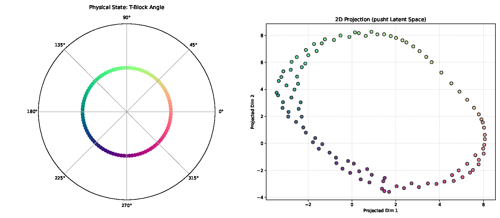
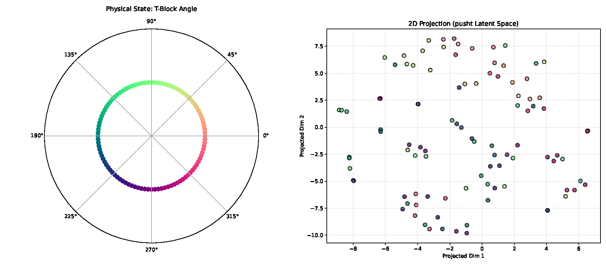
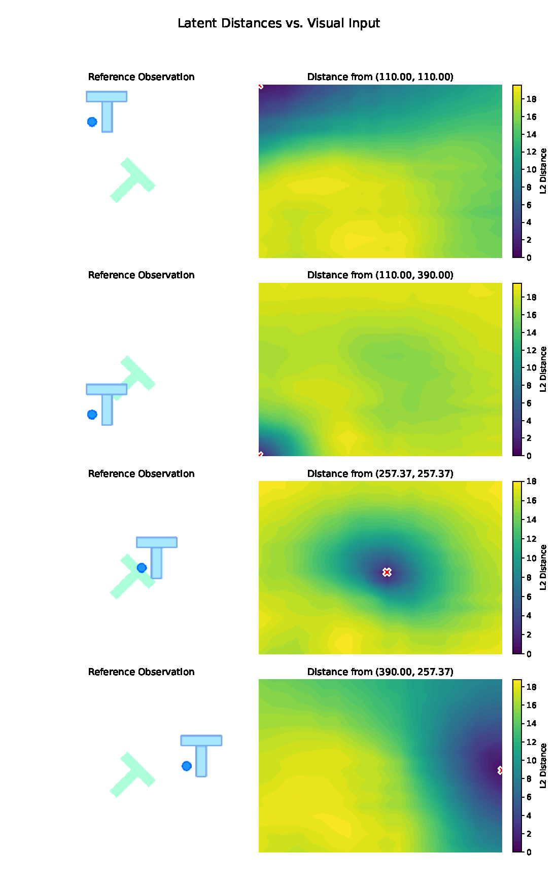
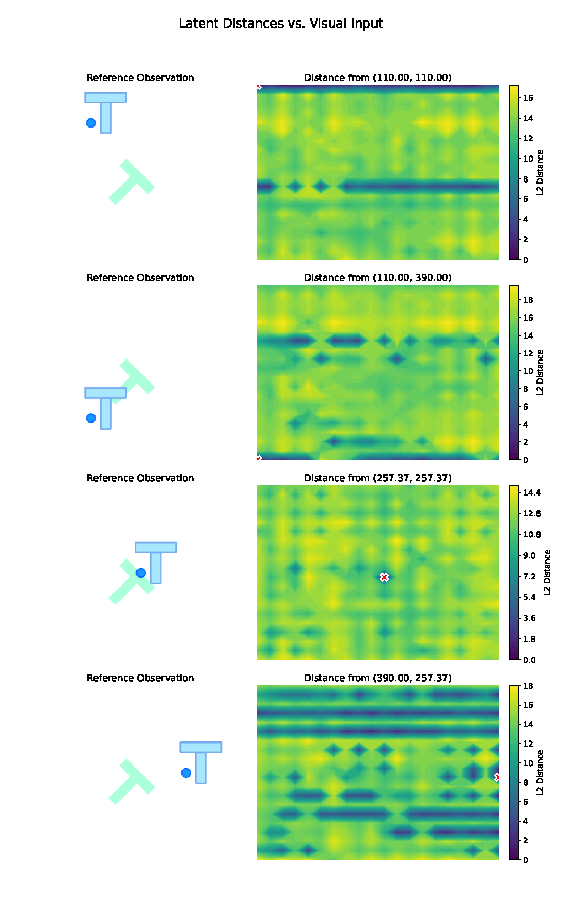
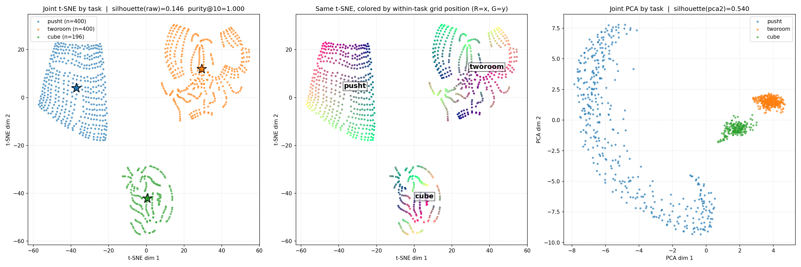
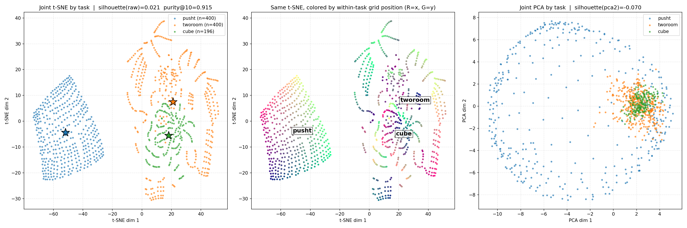
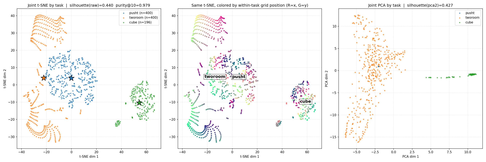

# 两任务 / 三任务 M0–M5 世界模型隐空间可视化评测报告

> 文档状态：全部 25 个（组 × 模型 × 任务）评测单元 + 10 个跨任务联合聚类单元已完成，175 个图像/视频/指标产物落盘并通过完整性校验。  
> 创建日期：2026-09-05  
> 最近更新：2026-09-05（追加第 5 节跨任务联合聚类评测）；2026-09-06（在关键结论处内嵌支撑图，rotation/distmap 已附 PNG 版）  
> 对应训练与控制实验报告：
> - 两任务：docs/pusht_tworoom_alignment_codebook_fusion_results.md
> - 三任务：docs/pusht_tworoom_cube_alignment_codebook_fusion_results.md

## 1. 评测对象与范围

对两组实验中全部多任务共享模型的 final checkpoint（每任务导出版，`task_evaluation/<task>/weights.pt + config.json`）执行 `scripts/visualization/` 下的隐空间可视化评测：

| 组 | 模型 | 任务 | 模型目录（`.stablewm/` 下） |
|---|---|---|---|
| two_task | M0 | pusht, tworoom | multitask_distillation/pusht_tworoom_m0_unaligned_concat_seed3072 |
| two_task | M2 | pusht, tworoom | multitask_distillation/pusht_tworoom_uot_seed3072 |
| two_task | M3 | pusht, tworoom | multitask_baseline/pusht_tworoom_m3_seed3072 |
| two_task | M4 | pusht, tworoom | multitask_distillation/pusht_tworoom_m4_continuous_seed3072 |
| two_task | M5 | pusht, tworoom | multitask_distillation/pusht_tworoom_m5_codebook_seed3072 |
| three_task | M0 | pusht, tworoom, cube | multitask_distillation/pusht_tworoom_cube_m0_unaligned_concat_seed3072 |
| three_task | M2 | pusht, tworoom, cube | multitask_distillation/pusht_tworoom_cube_uot_seed3072 |
| three_task | M3 | pusht, tworoom, cube | multitask_baseline/pusht_tworoom_cube_m3_seed3072 |
| three_task | M4 | pusht, tworoom, cube | multitask_distillation/pusht_tworoom_cube_m4_continuous_seed3072 |
| three_task | M5 | pusht, tworoom, cube | multitask_distillation/pusht_tworoom_cube_m5_codebook_seed3072 |

每个（组 × 模型 × 任务）单元产出三类视图（共 25 单元 × 5 文件 = 125 个产物）：

1. **env grid 隐空间拓扑**（`visualize_env.py`）：环境状态网格 → 模型 embedding → t-SNE 2D 投影（颜色 = 物理坐标），另含每个 variation 的隐空间 L2 距离热图（4 个参考点的 distmap）；
2. **PushT rotation sweep**（仅 pusht）：T 块角度 0→2π 共 100 个状态 → 隐空间 t-SNE，检验一维圆拓扑是否保持；
3. **轨迹隐空间可视化**（`visualize_trajectories.py`）：每任务数据集固定 seed=42 抽 4 条专家轨迹，真值编码（实线）与模型自身 rollout 预测（虚线）做联合 PCA 投影叠加，另输出左视频/右隐空间轨迹动画（mp4）。

## 2. 评测协议

- 状态网格：pusht / tworoom 20×20（各 1/2 个 variation），cube 14×14（2 个 variation：`cube.goal_position`+`cube.goal_yaw`、`floor.color`+goal）。所有模型使用完全相同的状态网格与 variation（与 `configs/config_envs.yaml` 默认一致），保证跨模型可比。
- 降维：env 视图 t-SNE（perplexity 自动 ≤30，seed=42）；轨迹视图 PCA（全局结构保持）。
- 轨迹 rollout：history=3、num_preds=1、frameskip=5（与训练一致），逐模型加载对应任务导出 checkpoint（`MultiTaskDistilledLeWM`/部署配置，`default_task_id` 固定为该任务）。
- 计算资源礼节：与既有训练共存运行——全部推理 `device=cpu`、`nice -n 19`、每进程 ≤4 线程；仅 Cube 的 MuJoCo EGL 渲染上下文使用 GPU 3（`MUJOCO_GL=egl`，微秒级渲染，不触碰训练进程）。
- 环境名修正：`swm/TwoRoom-v0` 已弃用，全部运行使用 `swm/TwoRoom-v1`；`visualize_env.py` 的 `MUJOCO_GL` 由硬编码 `glfw` 改为 `setdefault`（尊重外部注入的 `egl`，默认行为不变）。

## 3. 产物索引

根目录：`docs/assets/latent_space_vis/<group>/<MODEL>/<task>/`

每单元 5 个文件（pusht 单元含 rotation；tworoom/cube 单元含 2 张 distmap）：

- `<MODEL>_<task>_env_tsne.pdf` — 状态网格隐空间 t-SNE（左：物理网格；右：2D 投影，颜色编码物理坐标）
- `<MODEL>_<task>_env_var_<V>_distmap.pdf` — 隐空间距离热图；`<V>` ∈ {`original`（pusht/tworoom）, `background.color`（tworoom）, `cube.goal_position`, `floor.color`（cube）}
- `<MODEL>_pusht_rotation_tsne.pdf` — 角度扫描（仅 pusht）
- `<MODEL>_<task>_traj_pca.pdf` / `<MODEL>_<task>_traj.mp4` — 真值 vs 预测轨迹投影/动画
- 另含每步运行的 `<view>.log` 与 `done.txt` 标记

完整性校验（独立 agent 抽查 + 全量文件检查）：25/25 单元成功，125/125 产物存在且大小正常（PDF >10KB、mp4 >20KB），抽查 PDF 均为有效双面板图。唯一"差异"是 Cube 第一 variation 名为 `cube.goal_position`（配置如此，非 `original`），文件命名已如实反映。

## 4. 定性观察（视觉模型辅助读图，重点对比组）

> 说明：以下观察由视觉模型对渲染后的 PNG 逐图分析得到（关键图带文件名标签复核归因），描述图中的可验证结构；不包含任何定量指标。t-SNE 的碎片化本身可能只是投影伪影，需结合不经过投影的 distmap（直接隐空间 L2 距离）交叉判断。

### 4.1 PushT（差异最大的一组，对应控制成功率 M2=92% vs M0=74% vs M3=4%）

- **rotation 圆拓扑**：M2 的 100 个角度状态在 t-SNE 中形成**闭合圆环，颜色沿环单调渐进**，与左图单位圆拓扑一致；M3 则**散落成多个色块混杂的簇，无环状结构**，仅部分保留角度信息。这是两者 PushT 表示质量最直接的拓扑证据。

  

  

- **distmap 度量几何**（不经投影、直接隐空间距离）：M2 的 4 张热图中 3 张呈**以参考点为中心的平滑、近似同心圆的单峰距离场**（度量式几何；角点参考那张在远处饱和）；M3 的 4 张全部**呈条带状/斑块状、非单峰**，参考点邻域几乎不构成极小，说明其 PushT 隐空间对智能体 XY 位置不具度量结构。

  

  
- **env grid t-SNE**：M0 呈单连通、保留网格纹理的连续流形；M3 为大尺度连续但有折叠/臂状分叉、局部颜色混合；M2 反而呈 ~4 个不相连簇（簇内颜色连续）。结合 M2 优秀的 rotation/distmap 表现，该碎片化更可能是 t-SNE（perplexity=30、400 点）对流形的撕裂伪影，而非表示缺陷——再次说明需要多视图交叉判断。
- **轨迹 rollout（3 步短时程）**：M2 与 M3 的真值/预测轨迹都整体贴合、平滑、端点基本重合（端点间距 ≲5% 画幅；M2 最长分支上有轻微漂移）。即 M3 的 PushT 失效**不出现在短时程 latent rollout**，而是长时程规划/价值估计层面的失效（与其 validation prediction MSE 在训练后期恶化至 0.22 相符）。

### 4.2 Two-Room（所有模型控制表现都好：82%–98%）

- M2（three_task）：**平滑多叶流形**，叶结构与两房间拓扑一致；原始与背景变色两个 variation **完全分离成两份平行的"镜像拷贝"**——位置梯度在两份中都完整保留，外观扰动表现为隐空间中的整体平移而非畸变。
- M3（three_task）：同为平滑多叶流形，但两个 variation **点级交错在同一流形上**（对背景色近似不变），同样保留房间结构。
- 两种行为各有含义：教师蒸馏的 M2 对外观变化敏感但不破坏几何；SIGReg 训练的 M3 对外观更不变。控制成功率上两者接近（86% vs 92%），说明两种表示都足以支撑该任务。

### 4.3 Cube（三任务组新增；控制成功率 60%–74%）

- M2：流形分裂为 ~3 个簇；goal-variation 簇内红绿梯度大体连续、局部有穿插；两个 variation **完全分离**（隐空间编码了 variation 身份而非只编码物理位置）。
- M3：拓扑**大面积破碎**为多个不相连小岛、颜色混杂，variation 同样强分离且与状态纠缠。
- 两者的 Cube 隐空间都不理想（与 Cube 是三者中最难量化/控制的任务一致，C0 teacher 也仅 68%），M2 的 goal-variation 簇内结构仍优于 M3。

### 4.4 两任务 vs 三任务（PushT grid）

两任务组的 M0 与 M2 的 PushT 网格 t-SNE 均为**单连通、局部保序的连续盘状/环状流形**，无碎片化；三任务的 M2 出现前述簇分裂。这提示加入第三任务（Cube）后共享 PushT 半码本的隐空间组织更"分区化"，但其度量几何（distmap）与圆拓扑（rotation）依然保持——与三任务控制结果（M2 PushT 92%，未因加入 Cube 下降）一致。

## 5. 跨任务联合隐空间聚类

单任务视图（第 4 节）之外，追加**跨任务联合聚类**评测：把同一共享模型的多个任务隐变量放进同一投影与同一度量空间，检验共享表示是否/如何按任务分区。产物位于 `docs/assets/latent_space_vis/<group>/<MODEL>/cross_task/`：

- `<MODEL>_cross_task_cluster.{pdf,png}`：三面板——① 各任务状态网格隐变量合并后的联合 t-SNE（按任务着色，★=任务质心）；② 同一 t-SNE 布局按任务内归一化网格位置着色（检查各分区内部拓扑）；③ 联合 PCA（全局结构下任务间距）
- `<MODEL>_cross_task_cluster_metrics.json`：raw 192 维空间的定量指标
- `<MODEL>_cross_task_traj_tsne.pdf` / `<MODEL>_cross_task_traj.mp4`：三任务各 4 条专家轨迹真值 + 各自任务条件 rollout 预测的联合 t-SNE

新增实现：`scripts/visualization/visualize_multitask_latents.py`（状态网格联合聚类 + 指标）、`scripts/visualization/configs/config_trajectories_multitask.yaml`（多数据集联合轨迹投影）。协议：状态网格 pusht/tworoom 20×20、cube 14×14、每任务单默认外观（`variation: []`），同一共享 encoder 编码（per-task 导出的 `encode` 任务无关、权重相同），seed=42。

### 5.1 聚类指标总表

| 组 | 模型 | silhouette (raw) | silhouette (PCA2) | kNN 任务纯度@10 | 任务质心距离 | 各任务 latent 范数 | 跨任务混合@10 |
|---|---|---:|---:|---:|---|---|---|
| two_task | M0 | 0.092 | 0.310 | 1.000 | 6.8 | 12.4 / 14.1 | ≈0 |
| two_task | M2 | 0.335 | 0.687 | 1.000 | 10.9 | 12.6 / 10.9 | 0 |
| two_task | M3 | 0.107 | 0.199 | 0.968 | 4.8 | 9.7 / 18.2 | tworoom 6.4% |
| two_task | M4 | 0.340 | 0.685 | 1.000 | 11.1 | 12.9 / 10.9 | 0 |
| two_task | M5 | 0.342 | 0.695 | 1.000 | 10.6 | 11.6 / 10.9 | 0 |
| three_task | M0 | 0.021 | **−0.070** | 0.915 | 6.9 / 7.5 / 4.6 | 12.6 / 14.1 / 9.8 | **tworoom 21.2%** |
| three_task | M2 | 0.146 | 0.540 | 1.000 | 9.0 / 7.2 / 4.8 | 12.8 / 8.1 / 5.9 | 0 |
| three_task | M3 | 0.440* | 0.427 | 0.979 | 4.0 / 12.7 / 13.3 | **0.1** / 18.7 / 13.3 | tworoom 5.3% |
| three_task | M4 | 0.149 | 0.536 | 1.000 | 9.1 / 7.5 / 4.6 | 12.9 / 8.1 / 6.2 | 0 |
| three_task | M5 | 0.157 | 0.555 | 1.000 | 8.7 / 7.0 / 4.8 | 11.9 / 8.1 / 6.1 | 0 |

\* M3 三任务的高 silhouette 是塌缩伪影，见 5.2。

### 5.2 发现

1. **对齐蒸馏模型（M2/M4/M5）的共享隐空间按任务完全分区**：kNN 任务纯度 1.0（k=10 内零跨任务近邻）、任务质心距离更大、联合 PCA 中三/两个任务呈清晰分离的瓣状结构，且**每个分区内位置梯度完整**（中面板）——"分而不乱"。M4/M5 的聚类结构与 M2 几乎相同（同一对齐框架），M2 相对它们的控制优势不体现在任务分区层面。

   

2. **未对齐 M0 在加入第三任务后分区模糊**：三任务 M0 的 tworoom 有 21.2% 跨任务近邻、纯度降至 0.915、PCA2 silhouette 为负（投影中 tworoom 与 cube 区域重叠）；两任务 M0 虽纯度仍 1.0，但 silhouette（0.092 vs M2 0.335）与质心距离（6.8 vs 10.9）显著低于对齐模型。Procrustes 对齐的另一个可测收益：**更干净、更稳定的任务分区**。

   

3. **M3 三任务的 PushT 表示塌缩**：PushT latent 平均范数 0.1（两任务时 9.7；对比 M2 的 12.8）——联合图上 PushT 塌缩为原点附近的微小子球，几乎无位置信息。其高 silhouette（0.44）只是"小球远离大云"的平凡可分，不是好的聚类结构。这为 M3 PushT 4% 的控制崩溃给出了最直接的表示层证据（两任务 M3 尚未塌缩，仅有尺度失衡 9.7 vs 18.2 与质心最近 4.8）。

   
4. **任务分区与码本级结论一致**：蒸馏模型学生隐空间的任务完全分区与教师 token 的 I(token;task)=1 bit（两/三任务报告）相互印证——对齐让各任务分区几何更规整，但并未（也不需要）把不同任务的隐区域合并到一起；跨任务共享的是坐标系与几何质量，而非区域重叠。
5. 跨任务轨迹联合投影（`*_cross_task_traj_tsne.pdf`）显示各任务轨迹真值/预测簇在联合 t-SNE 中按任务成组、组内真值与预测贴合，与状态网格聚类结论一致。

## 6. 结论

1. **隐空间几何与控制成功率方向一致**：PushT 上 M2（92%）具有度量式距离场与完好的圆拓扑，M3（4%）两者皆失，M0（74%）居中。隐空间可视化为 MPC 控制差距提供了表示层面的解释。
2. **M3 的失效模式被定位在长时程动力学/规划价值估计**：其 3 步短时程 latent rollout 与真值贴合良好，失效体现在距离场非度量、圆拓扑破碎——即"能局部预测、不能全局度量"。
3. **外观变化的行为差异**（Two-Room）：M2 把 variation 编码为平行位移，M3 近似不变；两者控制均正常，属表示风格差异而非优劣。
4. **Cube 对所有模型都是最难表示的任务**，与量化误差、控制结果一致。
5. t-SNE 碎片化（三任务 M2 PushT grid）单独不可作为表示缺陷的证据，必须与 distmap/rotation 交叉判断——本报告的多视图协议即为此设计。
6. **跨任务联合聚类**（第 5 节）：对齐蒸馏模型（M2/M4/M5）的共享隐空间按任务完全分区且各分区内部拓扑完好；未对齐 M0 在三任务下分区模糊（tworoom 21% 跨任务近邻）；M3 三任务的 PushT 隐变量塌缩（范数 0.1）是其控制崩溃的直接表示层证据。对齐的收益同时体现在"分区内几何质量"与"分区边界的干净程度"。

## 7. 局限

- 定性读图由视觉模型辅助完成（关键图带标签复核），非人工逐图确认；未提取定量拓扑指标（如物理-隐空间距离 Spearman 相关、kNN 拓扑保持率），可作为后续工作用同一套产物协议补算。
- 所有图均为单训练 seed（3072）、单可视化 seed（42）的快照。
- 轨迹视图 rollout 仅 3 步（num_preds=1、窗口 4 帧），不能反映长时程漂移；长时程行为请以 MPC 评测为准。

## 8. 复现

从 `scripts/visualization/` 目录外任意位置（建议每单元独立输出目录）运行，环境变量 `STABLEWM_HOME=<repo>/.stablewm`：

```bash
# env grid（以 three_task M2 pusht 为例；tworoom 需加 datasets.two_room.env.env_name=swm/TwoRoom-v1；
# cube 加 MUJOCO_GL=egl MUJOCO_EGL_DEVICE_ID=3 CUDA_VISIBLE_DEVICES=3，grid_size=14，并删除其余 datasets 键）
python scripts/visualization/visualize_env.py \
  '~datasets.two_room' '~datasets.ogbench_cube' \
  +datasets.pusht.world_model.checkpoint_path=<repo>/.stablewm/multitask_distillation/pusht_tworoom_cube_uot_seed3072/task_evaluation/pusht \
  datasets.pusht.env.grid_size=20 device=cpu

# PushT rotation sweep：同上再加
#   datasets.pusht.env.visualization_mode=rotation datasets.pusht.env.rotation_steps=100

# 轨迹可视化（数据集名：pusht→galilai-group--lewm-pusht；
# tworoom→quentinll--lewm-tworooms/tworoom.h5；cube→quentinll--lewm-cube/cube_single_expert.h5）
python scripts/visualization/visualize_trajectories.py \
  datasets.pusht_train.dataset.dataset_name=galilai-group--lewm-pusht \
  datasets.pusht_train.dataset.n_trajectories=4 \
  datasets.pusht_train.world_model.model_name=<同上 checkpoint 目录> \
  device=cpu
```

跨任务联合聚类（状态网格 + 指标）：

```bash
# cube 需前置 MUJOCO_GL=egl MUJOCO_EGL_DEVICE_ID=3 CUDA_VISIBLE_DEVICES=3
python scripts/visualization/visualize_multitask_latents.py \
  --checkpoint <repo>/.stablewm/multitask_distillation/pusht_tworoom_cube_uot_seed3072/task_evaluation/pusht \
  --tasks pusht tworoom cube \
  --grid-size 20 --cube-grid-size 14 \
  --output-name M2_cross_task --device cpu

# 跨任务轨迹联合投影（两任务模型追加 '~datasets.cube_train'）
python scripts/visualization/visualize_trajectories.py \
  --config-name config_trajectories_multitask \
  datasets.pusht_train.world_model.model_name=<pusht 导出> \
  datasets.tworoom_train.world_model.model_name=<tworoom 导出> \
  datasets.cube_train.world_model.model_name=<cube 导出> \
  device=cpu
```
