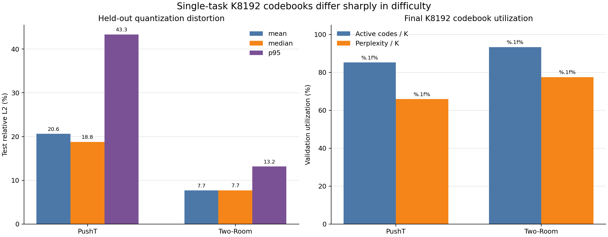
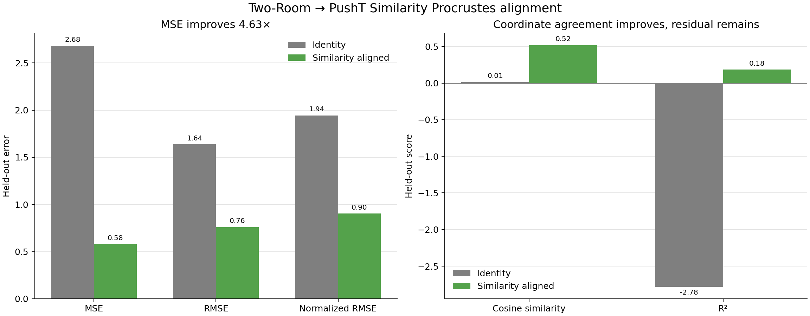
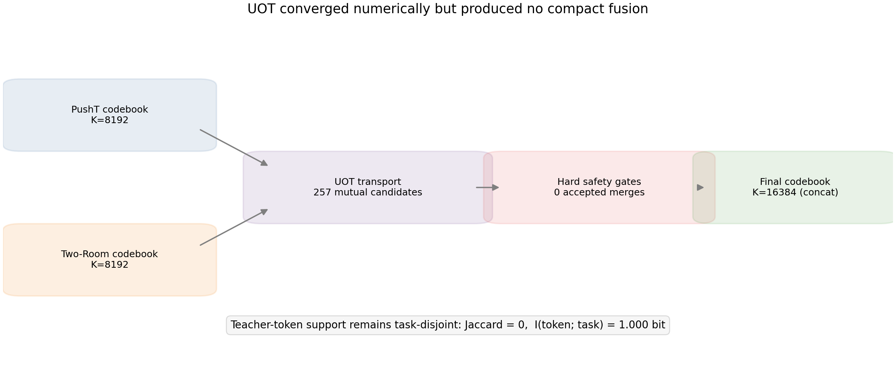
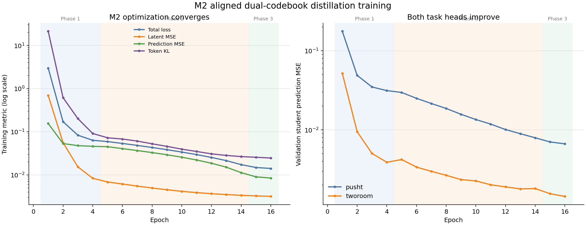
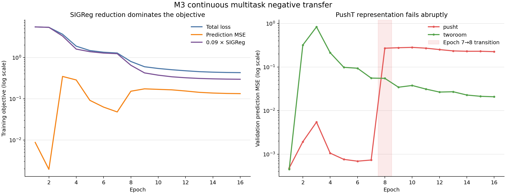
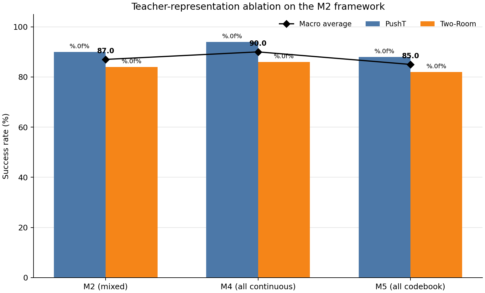

# PushT × Two-Room 隐空间对齐、码本融合与多任务世界模型实验报告

## 1. 摘要

本次实验完成了以下主流程：

1. 下载并兼容化官方 Two-Room LeWM checkpoint 与数据集；
2. 为 PushT、Two-Room 分别训练 K=8192、D=192 的离散码本；
3. 用混合任务同图像 anchor 拟合 Two-Room → PushT 的 Similarity Procrustes 对齐；
4. 在公共空间中执行 Unbalanced OT（UOT）候选匹配与自适应码本构造；
5. 生成双任务离线教师缓存；
6. 训练对齐+离散蒸馏共享模型 M2；
7. 训练不使用教师、对齐或码本的原生连续多任务基线 M3；
8. 在完全相同的 PushT/Two-Room 评估起点上完成双环境 MPC 评估；
9. 补充评估官方 Two-Room 连续 teacher（R0）；
10. 训练并评估单任务 Two-Room K=8192 VQ-LeWM（R1）；
11. 训练并评估未对齐、零合并 K=16384 多任务负对照（M0）；
12. 训练并评估教师表示消融 M4（第一、三项全部使用教师连续向量 z^T，删除软 token 项）；
13. 训练并评估教师表示消融 M5（第一、三项全部使用离散码本向量 c_{y^T}）。

主任务结果如下：

| 模型 | PushT | Two-Room | 宏平均 |
|---|---:|---:|---:|
| R0 官方 Two-Room 连续 teacher | 不适用 | 43/50 = 86% | 不适用 |
| R1 单任务 Two-Room VQ | 不适用 | 42/50 = 84% | 不适用 |
| M0 未对齐双码本蒸馏 | 39/50 = 78% | 41/50 = 82% | 80% |
| M3 原生连续多任务基线 | 3/50 = 6% | 49/50 = 98% | 52% |
| M2 对齐+离散蒸馏 | 45/50 = 90% | 42/50 = 84% | 87% |
| M4 全连续教师消融（M2 变体） | 47/50 = 94% | 43/50 = 86% | 90% |
| M5 全离散码本消融（M2 变体） | 44/50 = 88% | 41/50 = 82% | 85% |
| M2 − M3 | **+84 个百分点** | **−14 个百分点** | **+35 个百分点** |
| M2 − M0 | **+12 个百分点** | **+2 个百分点** | **+7 个百分点** |
| M4 − M2 | **+4 个百分点** | **+2 个百分点** | **+3 个百分点** |
| M5 − M2 | **−2 个百分点** | **−2 个百分点** | **−2 个百分点** |

核心结论：

- M2 显著提高了双任务宏平均成功率，并消除了 M3 在 PushT 上的严重失效。
- M3 出现明显任务负迁移：训练后期优化 SIGReg 时牺牲了 PushT 动力学表示。
- 在模型规模、训练阶段、3-GPU world size、global batch 和优化超参数一致时，M2 相比未对齐 M0 的宏平均提高 7 pp（80%→87%）；收益主要来自 PushT 的 78%→90%。这是本轮对 Procrustes 对齐价值最直接的受控证据。
- R0 使用官网下载的官方 Two-Room LeWM checkpoint，只做本地兼容转换与评估，并非本地重新训练；R1 码本由冻结 R0 encoder 在 Two-Room 数据上提取的 latent 训练得到，而不是直接从 checkpoint 权重中截取。
- Two-Room 的离散化控制损失较小：R0=86%，R1 最佳阶段=84%，相差 −2 pp；相比之下 PushT 的 P0→P1 为 −12 pp。
- Similarity Procrustes 显著改善了 held-out 对齐误差，并严格保持 Two-Room 原始 token assignment。
- UOT 数值求解成功收敛，但保守硬化门限接受了 **0 个合并对**；最终 K_shared=16384。因此本轮 M2 实际上是“对齐后的双码本拼接”，在功能上等价于原方案的 M1 上界，并没有证明紧凑共享码本融合有效。
- **M4/M5 教师表示消融**：在 M2 框架上只替换三项损失中教师表示的来源。M4（全部用教师连续向量 z^T，删除软 token 项）宏平均 90%，是本轮全部两任务模型中最高——PushT 94% 超过官方连续 teacher P0 的 90%，Two-Room 86% 与 R0 持平；相对 M2 为 +4/+2 pp（宏平均 +3 pp）。M5（全部用离散码本向量 c_{y^T}）宏平均 85%，比 M2 低 2 pp，但仍高于 M0（80%）与 M3（52%）。
- 连续 ≥ 混合 ≥ 离散的排序与三任务消融一致，但两任务设置下连续教师目标的优势更明显（三任务中 M4 与 M2 基本持平，−0.7 pp）。M4/M5 与 M2 的差值最多对应 3 个评测 episode，均为单 seed 点估计。
- R0、R1、M0 已补齐；按要求不再单独运行 M1，因为零合并的 M2 已是 M1-equivalent。当前仍缺少多随机种子、非零融合容量—质量曲线，以及与 M2 严格对齐训练调度的 M3 复核。

## 2. 实验完成状态与范围

主流水线于 2026-08-27 12:55:20 UTC 启动，于 2026-08-28 06:38:43 UTC 完成，总耗时约 **17.72 小时**。随后补充的 R0、R1、M0 均已完成；M0 流水线于 2026-08-28 20:58:34 UTC 标记为 complete。追加的 M4/M5 教师表示消融于 2026-09-01 11:15:44 UTC 启动，于 2026-09-02 00:37:37 UTC 标记为 complete（M4 训练约 6.7 小时、评测约 2 分钟；M5 训练约 6.6 小时、评测约 2 分钟）。全部实际启动的阶段均正常退出。

| 编号/阶段 | 状态 | 本轮结果 |
|---|---|---|
| 官方 PushT teacher | checkpoint 已验证 | 用于 anchor、码本与教师缓存；未单独重跑 P0 控制成功率 |
| PushT K=8192 码本 | 完成 | 有完整 train/validation/test 量化报告 |
| 官方 Two-Room teacher / R0 | 下载、兼容转换、严格加载并完成评估 | 43/50=86%；官方模型，本地未重新训练 |
| Two-Room K=8192 码本 | 完成 | 100 epochs，有完整 train/validation/test 量化报告 |
| Similarity Procrustes | 完成 | held-out 对齐显著优于 identity；token preservation=100% |
| UOT 自适应融合 | 完成但零合并 | 257 个 mutual candidates，0 个最终 merges，K_shared=16384 |
| 多任务教师缓存 | 完成 | 两任务完整 train/validation 缓存，约 5.3 GiB |
| M2 | 完成 | 16 epochs、三阶段、3-GPU DDP、双环境评估完成 |
| M3 | 完成 | 16 epochs、2-GPU DDP、双环境评估完成 |
| M0 未对齐负对照 | 完成 | 16 epochs、三阶段、3-GPU DDP；PushT=78%、Two-Room=82% |
| M4 全连续教师表示消融 | 完成 | 16 epochs、三阶段、3-GPU DDP；PushT=94%、Two-Room=86%、宏平均 90% |
| M5 全离散码本教师表示消融 | 完成 | 16 epochs、三阶段、3-GPU DDP；PushT=88%、Two-Room=82%、宏平均 85% |
| 独立 M1 对齐零合并上界 | **未单独运行** | 由于 M2 得到 0 merges，本轮 M2 在码本结构上等价于 M1 |
| P0 官方 PushT / P1 单任务 PushT VQ | 已有同协议结果 | 复用此前固定 Seed=42、相同 50 个 PushT 起点的评估：P0=90%，P1 最佳阶段=78% |
| R0 官方 Two-Room / R1 单任务 Two-Room VQ | 完成 | 相同 Seed=42、相同 50 个 Two-Room 起点：R0=86%，R1 最佳阶段=84% |
| 多随机种子、容量—质量阈值曲线 | **未运行** | 无稳定性结论 |

## 3. 环境、硬件与数据

### 3.1 软件与硬件

- Conda 环境：swm-env
- PyTorch：2.13.0+cu126
- GPU：NVIDIA A100-SXM4-80GB，使用物理 GPU 1/2/3
- M3：GPU 2/3，world size=2
- Two-Room 码本、对齐、UOT、并行教师缓存：GPU 1
- M2：GPU 1/2/3，world size=3
- R1、M0：GPU 1/2/3，world size=3
- 训练 seed：3072
- MPC 评估 seed：42
- 输入：224×224 RGB
- latent：192 维
- history：3
- 训练窗口：4 帧
- frameskip：5
- action block：10 维

日志中出现 TorchCodec/libnvrtc.so.13 与 Lance fork-safe 警告，但它们没有中止数据读取、训练或评估，所有最终 checkpoint 与 JSON 结果均成功生成。

### 3.2 数据规模

多任务训练使用 num_steps=4、frameskip=5 后的窗口：

| 任务 | 总窗口数 | Train | Validation |
|---|---:|---:|---:|
| PushT | 1,981,721 | 1,783,548 | 198,173 |
| Two-Room | 730,809 | 657,728 | 73,081 |

两个任务在每个 optimizer step 中等量采样。每轮由较小的 Two-Room split 决定步数，因此 PushT 每轮只抽取与 Two-Room 等量的窗口，而不是遍历全部 PushT train split。

单任务码本提取使用 num_steps=1、frameskip=1：

| 任务 | 可用窗口 | 码本 latent 缓存 | 独立 test latent |
|---|---:|---:|---:|
| PushT | 2,336,736 | 262,144 | 32,768 |
| Two-Room | 920,809 | 262,144 | 32,768 |

码本缓存内部将 262,144 个 latent 按 90/10 分为 235,929 train 和 26,215 validation。

## 4. 官方 checkpoint 与兼容性处理

官方 Two-Room checkpoint 使用旧 Hugging Face ViT state-dict 命名。通过与已验证 PushT 兼容 checkpoint 对照，使用以下等价映射转换：

- encoder.encoder.layer → encoder.layers
- attention.attention.query/key/value → attention.q_proj/k_proj/v_proj
- attention.output.dense → attention.o_proj
- intermediate.dense → mlp.fc1
- output.dense → mlp.fc2

转换后的 Two-Room checkpoint 共 303 个张量，能够 strict=True 加载，转换前后对应权重逐张量一致。

主要资产：

- PushT teacher：../.stablewm/checkpoints/official_lewm_pusht_compat
- Two-Room teacher：../.stablewm/checkpoints/official_lewm_tworooms_compat
- Two-Room 数据：../.stablewm/datasets/quentinll--lewm-tworooms/tworoom.h5

## 5. 单任务 K=8192 码本结果

两个码本均使用 8192 个 192 维 code、EMA teacher、100 epochs，并在 train/validation/test 上执行独立量化评估。

### 5.1 训练与 code usage

| 指标 | PushT | Two-Room |
|---|---:|---:|
| Best epoch | 100 | 100 |
| Best validation teacher L2（脚本字段名） | 10.7681 | 1.35077 |
| Train active codes | 8192/8192 = 100% | 8192/8192 = 100% |
| Validation active codes | 6980/8192 = 85.21% | 7645/8192 = 93.32% |
| Validation dead-code fraction | 14.79% | 6.68% |
| Validation perplexity | 5399.03 | 6346.82 |

### 5.2 独立 test 量化误差

| 指标 | PushT | Two-Room |
|---|---:|---:|
| Test vectors | 32,768 | 32,768 |
| Absolute L2 mean | 2.83734 | 1.06355 |
| Absolute L2 median | 2.57882 | 1.06213 |
| Absolute L2 p95 | 5.93615 | 1.84376 |
| Relative L2 mean | 20.62% | 7.70% |
| Relative L2 median | 18.77% | 7.70% |
| Relative L2 p95 | 43.34% | 13.16% |

不同 teacher latent 的绝对尺度不同，因此 absolute L2 不适合直接跨任务比较；relative L2 表明 PushT latent 的 K=8192 量化明显更困难。

完整结果：

- PushT：../.stablewm/codebook_runs/official_lewm_pusht_compat_codebook_k8192/quantization_evaluation.json
- Two-Room：../.stablewm/codebook_runs/official_lewm_tworooms_compat_codebook_k8192/quantization_evaluation.json

## 6. Similarity Procrustes 对齐结果

### 6.1 校准集

以 PushT teacher 空间作为参考空间，将相同图像同时送入两个冻结 teacher：

| 来源图像 | Anchor 数 |
|---|---:|
| PushT | 32,768 |
| Two-Room | 32,768 |
| 合计 | 65,536 |
| Alignment train | 58,982 |
| Held-out validation | 6,554 |

拟合得到：

- scale：0.3338676
- bias L2 norm：9.90018
- source：Two-Room
- reference：PushT

### 6.2 Held-out 指标

| 指标 | 未对齐 identity | Similarity 对齐后 |
|---|---:|---:|
| MSE | 2.68138 | **0.57901** |
| RMSE | 1.63749 | **0.76093** |
| Normalized RMSE | 1.94448 | **0.90358** |
| R² | −2.78098 | **0.18354** |
| Cosine similarity | 0.01470 | **0.51693** |
| SVCCA mean | 0.16784 | 0.16784 |
| MSE improvement ratio | 1.0× | **4.63097×** |

附加验证：

- Two-Room token preservation：**100%**
- 对齐→逆对齐 round-trip max absolute error：4.77×10⁻⁶
- Two-Room source effective rank：19.10
- 对齐后 effective rank：19.10
- PushT reference effective rank：44.67

解释：

- Similarity transform 明显改善了坐标一致性，并按设计保持原码本最近邻关系。
- 但 normalized RMSE 仍为 0.904、R² 仅为 0.184，说明刚性 similarity mapping 只解释了部分跨 teacher 差异。
- Similarity transform 不改变源空间 effective rank；Two-Room 与 PushT 的 effective-rank 差距仍然存在。
- SVCCA 对可逆线性坐标变换基本不敏感，因此映射前后数值相同并不矛盾。

完整结果：../.stablewm/multitask/pusht_tworoom_alignment.json

## 7. UOT 码本融合结果

### 7.1 搜索与收敛

使用平方欧氏距离和 median cost normalization，扫描：

- rho：0.05、0.1、0.2
- epsilon：0.01、0.03
- keep threshold：0.5
- mass threshold：0.5
- radius threshold：1.0
- Ward threshold：1.0
- 每任务量化误差退化预算：2%

选中组合：

| 参数 | 值 |
|---|---:|
| rho | 0.05 |
| epsilon | 0.01 |
| keep threshold | 0.5 |
| mass threshold | 0.5 |
| radius threshold | 1.0 |
| Ward threshold | 1.0 |
| Cost scale | 297.6629 |

求解状态：

- iterations：61
- residual：0
- converged：true
- transported mass：0.00303083

### 7.2 融合结果

| 指标 | 结果 |
|---|---:|
| PushT codes | 8192 |
| Two-Room codes | 8192 |
| Active PushT codes | 8192 |
| Active Two-Room codes | 8192 |
| Mutual candidates | 257 |
| Accepted merges | **0** |
| Merge fraction | **0%** |
| Final K_shared | **16384** |
| PushT QE ratio | 1.0 |
| Two-Room QE ratio | 1.0 |

六组 rho/epsilon 组合在固定硬化门限下全部得到 0 merges。由于没有合并，两个任务的量化误差没有退化，但这只是零合并的平凡满足。

### 7.3 Token 任务分区诊断

从离线教师缓存的 validation hard tokens 中按任务等量抽取 292,324 个 token：

| 指标 | 结果 |
|---|---:|
| PushT unique tokens | 8190 |
| Two-Room unique tokens | 8182 |
| Token-set intersection | **0** |
| Jaccard overlap | **0** |
| PushT 使用参考码本前半区比例 | 100% |
| Two-Room 使用源码本后半区比例 | 100% |
| I(token; task) | **1.000 bit** |
| 以 H(task) 归一化的 MI | **1.000** |

该统计针对教师缓存 assignment。它说明最终 16384 码本被完全分成两个任务专属分区，没有出现共享 code。

因此，本轮 UOT 的准确结论是：

> 数值优化成功，但高置信硬化规则没有找到任何可安全合并的跨任务 code；最终产物是对齐后的零合并拼接码本，而不是紧凑融合码本。

完整结果：../.stablewm/checkpoints/pusht_tworoom_fused_uot/metadata.json

## 8. 多任务教师缓存

缓存包含每个任务 train/validation split 的：

- 对齐后 teacher latent：float16，形状 N×4×192
- hard token：uint16，形状 N×4
- top-32 token indices：uint16，形状 N×4×32
- top-32 probabilities：float16，形状 N×4×32
- 固定 split indices 与完整 checkpoint/hash 元数据

缓存总大小约 **5.3 GiB**，最终 metadata 自校验及 fused-codebook hash 校验通过。主流水线再次进入缓存阶段时检测到现有缓存并输出 Validated existing cache，没有重复覆盖有效数据。

路径：../.stablewm/distillation_cache/pusht_tworoom_fused

## 9. 共享架构、训练配置与补充控制实验

### 9.1 共享架构与参数量

两模型共享同规格的 ViT-Tiny encoder、projector、adapter、action encoder、task embedding、predictor 和 prediction head。

| 模块 | 参数量 |
|---|---:|
| Encoder | 5,501,376 |
| Projector | 792,768 |
| Adapter | 37,056 |
| Action encoder | 156,206 |
| Task embedding | 384 |
| Predictor | 10,791,360 |
| Prediction head | 792,768 |
| **可训练参数合计** | **18,071,918** |

M2 额外包含冻结码本 16,384×192 = 3,145,728 个标量，不计入可训练参数量。

| 模型 | Final checkpoint 大小 |
|---|---:|
| M3 | 72,442,379 bytes |
| M2 | 85,020,371 bytes |

### 9.2 训练调度差异

| 项目 | M3 | M2 |
|---|---:|---:|
| GPUs | 2（GPU 2/3） | 3（GPU 1/2/3） |
| 每任务每 GPU batch | 128 | 128 |
| 全局 sequence batch | 512 | 768 |
| 每步实际图像数（4 帧） | 2048 | 3072 |
| Steps/epoch | 2569 | 1712 |
| Epochs | 16 | 16 |
| Global optimizer steps | 41,104 | 27,392 |
| 主要训练耗时 | 10.32 h | 7.32 h |
| Precision | bf16 mixed | bf16 mixed |

两模型每轮看到的两任务样本总量近似相同，数据 split、网络参数量和评估起点一致；但是由于 world size 不同，**全局 batch 和 optimizer step 数并不严格一致**。因此这不是完全满足原方案“相同 global batch/优化步数”的严格受控对照，是解释结果时的重要限制。

### 9.3 M2 训练阶段

M2 使用 4/10/2 epochs 的三阶段训练：

1. Phase 1：以 teacher latent/token 为主，student fraction 从 0 开始；
2. Phase 2：逐步切换到 student latent；
3. Phase 3：student fraction=1.0，闭环微调。

最终训练指标：

| 指标 | Epoch 1 | Epoch 16 |
|---|---:|---:|
| Total loss | 2.97763 | **0.01408** |
| Latent MSE | 0.68957 | **0.003174** |
| Prediction MSE | 0.15513 | **0.008445** |
| Token KL | 21.3292 | **0.02459** |
| Student fraction | 0.0 | 1.0 |
| Samples/s/rank | 297.27 | 319.81 |

最终分任务 validation：

| 指标 | PushT | Two-Room |
|---|---:|---:|
| Latent MSE | 0.006103 | 0.0002357 |
| Token agreement | 97.526% | 96.293% |
| Top-5 token agreement | 99.9994% | 99.9997% |
| Student prediction MSE | 0.006644 | 0.001440 |
| Teacher-code prediction MSE | 0.05600 | 0.002152 |
| Active codes / 16384 | 8190 | 8172 |
| Dead-code fraction | 50.01% | 50.12% |
| Perplexity | 6282.95 | 7299.53 |

约 50% 的 per-task dead-code fraction 与零合并、任务专属半码本一致。

### 9.4 R0：官方 Two-Room 连续 teacher

R0 **不是本地重新训练的模型**。它来自官网下载的官方 Two-Room LeWM checkpoint，本地仅完成旧版 Hugging Face ViT 字段名兼容转换、`strict=True` 权重加载验证和 MPC 评估；模型资产位于 `../.stablewm/checkpoints/official_lewm_tworooms_compat`。

在 Seed=42、与 R1/M0/M2/M3 相同的 50 个 Two-Room row indices、episode IDs 和 start steps 上，R0 成功 **43/50=86%**，评估耗时 36.01 s。结果文件为 `../.stablewm/checkpoints/official_lewm_tworooms_compat/task_evaluation/tworoom_results_official_seed42_50.json`。

### 9.5 R1：单任务 Two-Room K=8192 VQ-LeWM

R1 的码本来源链路为：

> 官方 R0 checkpoint → 冻结 R0 encoder 提取 Two-Room latent → 在这些 latent 上训练 K=8192、D=192 码本 100 epochs → 使用 R0 teacher/cache 与该码本执行联合蒸馏。

因此，R1 码本是从 **R0 表示产生的 latent 数据中训练得到**，不是从 R0 checkpoint 中直接提取或复制的一组模型权重。R1 没有使用跨任务 Procrustes，对齐变换为 null。码本 SHA-256 为 `b8ca9f51ed2438bfd2a3aeb9e02152a0b2e5de76472be3f2225276178ec7db3b`。

R1 保持与既有单任务 VQ 实验相同的 ViT-Tiny/192 维模型规模和三阶段超参数：

| 项目 | R1 |
|---|---:|
| 可训练参数 | 18,071,534 |
| GPUs / world size | GPU 1/2/3 / 3 |
| 每 GPU batch / global batch | 256 / 768 |
| Epochs | 16（4/10/2） |
| Loss weights | prediction=1.0，latent=1.0，soft KL=0.1 |
| Optimizer | AdamW，weight decay=1e-3，betas=(0.9, 0.999) |
| Precision / gradient clip | bf16 mixed / 1.0 |
| Train seed / MPC seed | 3072 / 42 |

其三个预登记评估阶段为：

| Checkpoint | 成功数 | 成功率 |
|---|---:|---:|
| Phase 1 | 40/50 | 80% |
| Phase 2（最佳） | **42/50** | **84%** |
| Final | 41/50 | 82% |

最终模型通过全部质量门限；关键 validation 指标为 latent MSE=0.0006833、soft KL=0.006135、token agreement=97.229%、top-5 agreement≈100%、perplexity ratio=0.99933、student prediction MSE=0.004220。R0→R1 的最佳阶段控制损失仅 **−2 pp（86%→84%）**。

配置与结果：

- 配置：`../scripts/train/config/vq_lewm_joint_distillation_tworoom.yaml`
- 模型目录：`../.stablewm/joint_distillation/lewm_tworooms_k8192_seed3072`
- MPC 汇总：`../.stablewm/joint_distillation/lewm_tworooms_k8192_seed3072/task_evaluation/summary.json`
- 最终质量评估：`../.stablewm/joint_distillation/lewm_tworooms_k8192_seed3072/final_evaluation.json`

### 9.6 M0：未对齐、零合并多任务负对照

M0 将 PushT 与 Two-Room 的两个 K=8192 原始码本直接拼接成 K=16384，`alignment.enabled=false`、`fusion.method=concat`、accepted merges=0。与 M2 相比，M0 只去掉 Two-Room→PushT 的 Procrustes 坐标对齐；共享模型规模、数据 split、教师缓存字段、三阶段训练、GPU 数、batch、loss、optimizer 和 seed 均保持一致。

| 项目 | M0 | M2 |
|---|---:|---:|
| 可训练参数 | 18,071,918 | 18,071,918 |
| 冻结码本 | K=16384，3,145,728 参数 | K=16384，3,145,728 参数 |
| 对齐 | 无 | Similarity Procrustes |
| 融合结果 | 原始 concat，0 merges | 对齐后 concat，0 merges |
| GPUs / world size | GPU 1/2/3 / 3 | GPU 1/2/3 / 3 |
| 每任务每 GPU batch | 128 | 128 |
| Global sequence batch | 768 | 768 |
| Epochs / 阶段 | 16 / 4+10+2 | 16 / 4+10+2 |
| Precision | bf16 mixed | bf16 mixed |
| Train seed / MPC seed | 3072 / 42 | 3072 / 42 |

M0 最终训练 loss=0.024680、latent MSE=0.005239、prediction MSE=0.016717、token KL=0.027239。最终分任务 validation 为：

| 指标 | PushT | Two-Room |
|---|---:|---:|
| Latent MSE | 0.009247 | 0.001210 |
| Token agreement | 97.085% | 96.981% |
| Top-5 token agreement | 99.9991% | ≈100% |
| Student prediction MSE | 0.010184 | 0.006315 |
| Active codes / 16384 | 8190 | 8180 |
| Dead-code fraction | 50.01% | 50.07% |
| Perplexity | 6284.05 | 7302.04 |

相同 MPC 协议下的直接受控比较为：

| 模型 | PushT | Two-Room | 总成功数 | 宏平均 |
|---|---:|---:|---:|---:|
| M0 未对齐 concat | 39/50 = 78% | 41/50 = 82% | 80/100 | 80% |
| M2 Procrustes、零合并 | 45/50 = 90% | 42/50 = 84% | 87/100 | 87% |
| M2 − M0 | **+12 pp** | **+2 pp** | **+7** | **+7 pp** |

由于 M0/M2 的模型规模和训练超参数严格一致，这一差值比 M2/M3 比较更直接地支持 Procrustes 对齐的作用；改善主要集中在量化更困难的 PushT。它仍是单 seed 结果，不能代替多种子显著性验证。

配置与结果：

- 配置：`../scripts/train/config/multitask_vq_lewm_m0_unaligned.yaml`
- 未对齐码本：`../.stablewm/checkpoints/pusht_tworoom_fused_unaligned_concat/metadata.json`
- 教师缓存：`../.stablewm/distillation_cache/pusht_tworoom_unaligned_concat`
- 模型目录：`../.stablewm/multitask_distillation/pusht_tworoom_m0_unaligned_concat_seed3072`
- MPC 汇总：`../.stablewm/multitask_distillation/pusht_tworoom_m0_unaligned_concat_seed3072/task_evaluation/summary.json`

### 9.7 M4、M5：教师表示消融（在 M2 框架上追加）

M4、M5 在 M2 的共享模型、对齐融合码本与相同训练设置（阶段/epochs/优化器/seed/GPU/global batch）之上，只修改三项损失中教师表示的来源，用于对比“教师编码器输出的连续、量化前向量 z^T = E_T(o)”与“量化后码本向量 c_{y^T}（y^T = argmin_k ||z^T − c_k||）”的效果。三项损失记为：第一项连续表示对齐（latent MSE）、第二项冻结码本上的软 token KL、第三项动力学预测（teacher-forcing 按 m ~ Bernoulli(α) 混合，h_t = (1−m)·teacher + m·z_t^S，预测输入和下一时刻目标同源）。

- **M4（全部用连续向量）**：
  - 第一项对齐目标对连续向量 z^T 计算 MSE（与 M2 相同，不变）；
  - 第二项软 token 对齐删除（token_weight = 0）；
  - 第三项动力学 teacher latent 使用 z^T = E_T(o_t)（即 prediction_source = continuous）。
- **M5（全部用离散码本向量）**：
  - 第一项对齐目标由“对连续 z^T 的 MSE”改为“对离散码本向量 c_{y^T} 的 MSE”（即 latent_target = codebook）；
  - 第二项、第三项保持与 M2 一致（token_weight = 0.1 保留；prediction_source = codebook）；
  - 即全部使用码本向量，不使用连续、量化前向量。

实现上，MultiTaskObjective 增加了三个配置开关：latent_target ∈ {continuous, codebook}、prediction_source ∈ {continuous, codebook}、token_weight（为 0 时完全跳过第二项）。默认值精确复现 M2，因此该改动对 M0/M2/M3 为无操作。M4/M5 复用 M2 已生成的融合码本与逐帧蒸馏缓存（pusht_tworoom_fused_uot / pusht_tworoom_fused），无需重新对齐、融合或缓存。

教师监督信号全部处于对齐后的 PushT 参考坐标系：缓存中的 teacher_latents 为对齐后的 Two-Room latent（PushT 恒等），M5 查询的融合码本后半区为对齐后的 Two-Room 码字。因此 M2/M4/M5 的唯一受控差异是教师目标的表示形式，而不是坐标系。

| 项目 | M4 | M5 |
|---|---:|---:|
| 可训练参数 | 18,071,918 | 18,071,918 |
| 冻结码本 | K=16384，3,145,728 参数 | K=16384，3,145,728 参数 |
| latent_target / prediction_source | continuous / continuous | codebook / codebook |
| token_weight | 0.0（第二项关闭） | 0.1（与 M2 一致） |
| GPUs / world size | GPU 1/2/3 / 3 | GPU 1/2/3 / 3 |
| 每任务每 GPU batch / global batch | 128 / 768 | 128 / 768 |
| Epochs / 阶段 | 16 / 4+10+2 | 16 / 4+10+2 |
| 训练耗时 | 约 6.7 h | 约 6.6 h |
| Train seed / MPC seed | 3072 / 42 | 3072 / 42 |

训练指标（epoch 1 / 8 / 16）：

| 指标 | M4 ep1 | M4 ep8 | M4 ep16 | M5 ep1 | M5 ep8 | M5 ep16 |
|---|---:|---:|---:|---:|---:|---:|
| Total loss | 0.60404 | 0.01196 | 0.00764 | 2.99662 | 0.06546 | 0.03610 |
| Latent MSE | 0.469011 | 0.001630 | 0.001271 | 0.688699 | 0.026959 | 0.025068 |
| Token KL | 0.0 | 0.0 | 0.0 | 21.53787 | 0.06185 | 0.03057 |
| Prediction MSE | 0.135025 | 0.010327 | 0.006373 | 0.154136 | 0.032314 | 0.007971 |

M4 全程 16 个 epoch 的 token_kl 均为 0，确认第二项在正式训练中完全关闭；M5 的 token KL 轨迹与 M2 一致（epoch 1 约 21.5 vs M2 的 21.3）。M5 的 PushT latent MSE（0.0251）比 M4（0.0013）高一个量级，因为其目标包含 PushT K8192 码本约 20.6% 的相对量化残差，属预期现象而非训练失败。

最终分任务 validation：

| 指标 | M4 PushT | M4 Two-Room | M5 PushT | M5 Two-Room |
|---|---:|---:|---:|---:|
| Latent MSE | 0.002259 | 0.000277 | 0.015131 | 0.000287 |
| Token agreement | 96.441% | 94.227% | 97.064% | 95.862% |
| Top-5 token agreement | 99.9985% | 99.9990% | 99.9985% | 99.9997% |
| Student prediction MSE | 0.003542 | 0.001062 | 0.006456 | 0.001452 |
| Active codes / 16384 | 8191 | 8164 | 8189 | 8175 |
| Dead-code fraction | 50.01% | 50.17% | 50.02% | 50.10% |

约 50% 的 per-task dead-code fraction 与零合并、任务专属半码本一致，和 M0/M2 相同。

配置与结果：

- M4 配置：`../scripts/train/config/multitask_vq_lewm_m4_continuous.yaml`
- M5 配置：`../scripts/train/config/multitask_vq_lewm_m5_codebook.yaml`
- M4/M5 续跑器：`../scripts/train/run_pusht_tworoom_m4_m5_gpu123.sh`（幂等，可断点续跑）
- M4 模型目录：`../.stablewm/multitask_distillation/pusht_tworoom_m4_continuous_seed3072`
- M5 模型目录：`../.stablewm/multitask_distillation/pusht_tworoom_m5_codebook_seed3072`
- M4/M5 MPC 汇总：各自模型目录下的 `task_evaluation/summary.json`

## 10. M3 原生连续多任务基线

M3 从随机初始化开始训练，不使用 teacher latent、Procrustes、codebook 或蒸馏缓存。总目标为：

L = prediction MSE + 0.09 × SIGReg

任务 ID 仅进入 predictor 的 action condition；共享视觉 encoder 本身没有 task conditioning。Prediction MSE 对两个等量拼接任务给出相同样本权重，但 SIGReg 在混合 latent 上统一计算，而不是按任务分别计算。

最终训练指标：

| 指标 | Epoch 1 | Epoch 16 |
|---|---:|---:|
| Total loss | 5.53464 | 0.43019 |
| Train prediction MSE | 0.008721 | 0.13310 |
| SIGReg | 61.3925 | 3.30113 |
| PushT validation prediction MSE | 0.000478 | **0.224831** |
| Two-Room validation prediction MSE | 0.000448 | **0.020721** |

### 10.1 任务负迁移转折

| Epoch | Train prediction MSE | SIGReg | PushT val MSE | Two-Room val MSE |
|---:|---:|---:|---:|---:|
| 1 | 0.00872 | 61.39 | 0.000478 | 0.000448 |
| 7 | 0.04783 | 13.77 | 0.000733 | 0.05560 |
| 8 | 0.15220 | 7.21 | **0.26992** | 0.05487 |
| 16 | 0.13310 | 3.30 | 0.22483 | **0.02072** |

Epoch 7→8 出现明显表示空间重组：

- Epoch 7：prediction=0.0478，0.09×SIGReg≈1.239，总 loss≈1.287；
- Epoch 8：prediction 恶化到 0.1522，但 0.09×SIGReg 降至约 0.649，总 loss 仍降到约 0.801；
- PushT validation MSE 同时从 0.000733 跃升到 0.2699，而 Two-Room 基本不变。

这表明总目标为了降低混合 SIGReg，接受了 PushT 动力学质量的大幅退化。结合 task ID 映射、平衡采样和独立动作归一化均已核验，M3 的 6%/98% 成功率差距更符合共享表示负迁移，而不是任务 ID 交换或数据不平衡。

## 11. MPC 主评估

### 11.1 协议

- 每任务 50 个 episode
- Seed=42
- 同一任务内的 P0/P1/R0/R1/M0/M2/M3 使用固定且相互一致的 row indices、episode IDs 和 start steps
- History length=3
- Planning horizon=5
- Receding horizon=5
- Action block=5
- Evaluation budget=50
- 每个导出模型仅通过 default_task_id 选择同一共享模型中的任务条件

### 11.2 完整基线矩阵成功率

| 编号 | 模型 | 码本 | 用途 | PushT 成功率 | Two-Room 成功率 | 宏平均 | 评测状态 |
|---|---|---|---|---:|---:|---:|---|
| P0 | 官方 PushT | 连续 | PushT 教师上界 | **45/50 = 90%** | 不适用 | 不适用 | 已评估；与 P1/M0/M2/M3 的 PushT 起点相同 |
| P1 | 单任务 PushT VQ | K=8192 | PushT 离散基线 | **39/50 = 78%** | 不适用 | 不适用 | 已评估；取最佳 Phase 2 checkpoint |
| R0 | 官方 Two-Room | 连续 | Two-Room 教师上界 | 不适用 | **43/50 = 86%** | 不适用 | 已评估；官方 checkpoint，本地未重训 |
| R1 | 单任务 Two-Room VQ | K=8192 | Two-Room 离散基线 | 不适用 | **42/50 = 84%** | 不适用 | 已评估；取最佳 Phase 2 checkpoint |
| M0 | 多任务共享模型 | 未对齐、零合并 K=16384 | 负对照 | **39/50 = 78%** | **41/50 = 82%** | **80%** | 已训练并完成双环境评估 |
| M1 | 多任务共享模型 | Procrustes、零合并 K=16384 | 不合并上界 | **未独立评估\*** | **未独立评估\*** | 未独立评估 | 按要求不单独运行 |
| M2 | 多任务共享模型 | Procrustes、自适应 K_shared（实际 K=16384） | 推荐融合方案 | **45/50 = 90%** | **42/50 = 84%** | **87%** | 已评估；UOT 实际 0 merges |
| M3 | 原生多任务模型 | 连续 latent，无对齐、无融合码本 | 官方原版训练方法的等参数 baseline | **3/50 = 6%** | **49/50 = 98%** | **52%** | 已评估 |
| M4 | 多任务共享模型（M2 变体） | 对齐 K=16384；教师全连续 z^T，无软 token 项 | 教师表示消融：全连续 | **47/50 = 94%** | **43/50 = 86%** | **90%** | 已评估；与 M0/M2/M3 相同起点、final checkpoint |
| M5 | 多任务共享模型（M2 变体） | 对齐 K=16384；教师全离散 c_{y^T}，软 token 项保留 | 教师表示消融：全离散 | **44/50 = 88%** | **41/50 = 82%** | **85%** | 已评估；与 M0/M2/M3 相同起点、final checkpoint |

说明：

- P0、P1、M0、M2、M3 的 PushT 结果使用相同的 50 个 row indices、episode IDs 和 start steps；R0、R1、M0、M2、M3 的 Two-Room 结果也使用同一组 50 个固定起点。
- P1 与 R1 按预登记规则报告最佳 Phase 2 checkpoint；对应 final checkpoint 分别为 38/50=76% 和 41/50=82%。
- \*M1 按要求不单独训练与评估，因此不重复登记数值；本轮 M2 接受 0 个 merge，最终 K_shared=16384，码本结构上等价于 M1。若按实际产物归类，M1-equivalent 结果即 PushT 90%、Two-Room 84%、宏平均 87%。
- 已补齐 R0、R1 和 M0，因而可以直接计算 Two-Room 离散化损失 R1−R0=−2 pp，以及对齐收益 M2−M0=+12/+2 pp（宏平均 +7 pp）。
- M4、M5 与 M0/M2/M3 使用完全相同的固定评测起点，且同样报告 final checkpoint；其与 M2 的受控差异只有损失函数中教师表示的来源（latent_target / prediction_source / token_weight 三个开关）。

左图显示单任务 VQ 相对各自连续 teacher 的控制损失；右图显示 M3 的严重任务失衡，以及 M0、M2 对 PushT 能力和宏平均的逐级恢复。

### 11.3 多任务模型的直接比较

| 模型 | PushT | Two-Room | 总成功数 | 宏平均 |
|---|---:|---:|---:|---:|
| M3 原生连续 | 3/50 = 6% | 49/50 = 98% | 52/100 | 52% |
| M0 未对齐双码本蒸馏 | 39/50 = 78% | 41/50 = 82% | 80/100 | 80% |
| M2 对齐+离散蒸馏 | 45/50 = 90% | 42/50 = 84% | 87/100 | 87% |
| M4 全连续教师消融 | 47/50 = 94% | 43/50 = 86% | 90/100 | 90% |
| M5 全离散码本消融 | 44/50 = 88% | 41/50 = 82% | 85/100 | 85% |
| M2 − M3 | **+84 pp** | **−14 pp** | **+35** | **+35 pp** |
| M2 − M0 | **+12 pp** | **+2 pp** | **+7** | **+7 pp** |
| M4 − M2 | **+4 pp** | **+2 pp** | **+3** | **+3 pp** |
| M5 − M2 | **−2 pp** | **−2 pp** | **−2** | **−2 pp** |

评估耗时：

| 模型 | PushT | Two-Room |
|---|---:|---:|
| M3 | 63.65 s | 33.05 s |
| M0 | 39.40 s | 34.32 s |
| M2 | 37.61 s | 36.93 s |
| M4 | 35.32 s | 34.92 s |
| M5 | 39.28 s | 34.63 s |

### 11.4 解释

- M3 在 Two-Room 上几乎满分，但在 PushT 上基本失效，说明原生共享连续训练产生严重任务偏置。
- 即使不做对齐，M0 的双 teacher/双码本蒸馏也达到 80% 宏平均，较 M3 提高 28 pp，并将 PushT 从 6% 恢复到 78%。
- 在模型规模与训练调度一致的 M0/M2 对照中，Procrustes 进一步将 PushT 从 78% 提高到 90%、Two-Room 从 82% 提高到 84%，宏平均提高 7 pp。
- M2 将 PushT 从 M3 的 6% 提升到 90%，同时 Two-Room 从 98% 降到 84%；宏平均提高 35 pp。
- 但因为 UOT 最终 0 merges，结果不能归因于紧凑的共享 code；它证明的是“对齐后的双码本蒸馏”优于未对齐 M0 和原生连续 M3，而不是“真正合并的码本”优于二者。
- M4（全连续教师表示）取得本轮全部两任务模型的最好结果：宏平均 90%，比 M2 高 3 pp；PushT 94% 超过官方连续 teacher P0 的 90%，Two-Room 86% 与 R0 持平。删除软 token 项、把动力学 teacher-forcing 源换成连续 z^T 没有损失精度，反而略有收益。
- M5（全离散教师表示）宏平均 85%，比 M2 低 2 pp，但仍高于 M0 的 80% 和 M3 的 52%。全离散化把码本量化残差直接写入对齐与预测目标（PushT K8192 的相对量化误差约 20.6%），是其退化的合理机制。
- 消融方向与三任务实验一致（连续 ≥ 混合 ≥ 离散）。两任务与三任务的差别在幅度：两任务下 M4 超过 M2（+3 pp），三任务下 M4 与 M2 基本持平（−0.7 pp）。
- M4−M2 与 M5−M2 的差值分别对应 3 个和 2 个评测 episode，且全部为单训练 seed 的点估计；应表述为现象，而非显著性结论。

教师表示消融显示：M4（全连续 z^T）宏平均 90.0%，超过 M2 混合方案（87.0%）；M5（全离散码本 c_{y^T}）宏平均 85.0%，损失集中在 PushT（90%→88%）与 Two-Room（84%→82%）。

结果文件：

- R0：../.stablewm/checkpoints/official_lewm_tworooms_compat/task_evaluation/tworoom_results_official_seed42_50.json
- R1：../.stablewm/joint_distillation/lewm_tworooms_k8192_seed3072/task_evaluation/summary.json
- M0：../.stablewm/multitask_distillation/pusht_tworoom_m0_unaligned_concat_seed3072/task_evaluation/summary.json
- M2：../.stablewm/multitask_distillation/pusht_tworoom_uot_seed3072/task_evaluation/summary.json
- M3：../.stablewm/multitask_baseline/pusht_tworoom_m3_seed3072/task_evaluation/summary.json
- M4：../.stablewm/multitask_distillation/pusht_tworoom_m4_continuous_seed3072/task_evaluation/summary.json
- M5：../.stablewm/multitask_distillation/pusht_tworoom_m5_codebook_seed3072/task_evaluation/summary.json

## 12. 原方案成功判据逐项判断

| 判据 | 本轮判断 | 说明 |
|---|---|---|
| 两个单任务 VQ 模型接近连续 teacher | **通过（单 seed）** | PushT：P1=78%，较 P0=90% 低 12 pp；Two-Room：R1=84%，较 R0=86% 低 2 pp |
| Similarity 保持 Two-Room token assignment | **通过** | Token preservation=100% |
| Held-out residual 显著优于未对齐 | **通过** | MSE 改善 4.63× |
| M3 能同时完成两个任务 | **部分通过/总体失败** | Two-Room=98%，PushT=6%，任务严重失衡 |
| K=16384 零合并模型能工作 | **通过** | 未对齐 M0=78%/82%；对齐零合并 M2=90%/84% |
| 自适应合并满足 QE 预算 | **平凡通过但无有效合并** | 0 merges，QE ratio=1.0 |
| 自适应模型接近单任务 VQ 与 M3 | **通过（单 seed）** | PushT 上 M2=90%，较 P1=78% 高 12 pp；Two-Room 上 M2=84%，与 R1=84% 相同、较 R0=86% 低 2 pp。M2 宏平均高于 M0/M3，但 Two-Room 较 M3 低 14 pp |
| K 与性能跨随机种子稳定 | **未测试** | 仅 seed=3072 |
| 容量—质量曲线可解释 | **未测试** | 固定硬门限下所有 UOT trial 均为 0 merges |

## 13. 主要限制

1. **UOT 没有产生真正融合。** 最终 K=16384、任务 token 支持完全分离；M2 实际是 M1-equivalent。
2. **仅一个训练随机种子。** R0/R1/M0 已补齐，50 episodes/任务给出了完整主控制矩阵，但不足以证明训练稳定性或 M2−M0 的统计显著性。M4/M5 同为单 seed：M4−M2 的 +3 pp 宏平均对应 3 个评测 episode、M5−M2 的 −2 pp 对应 2 个 episode，且两任务与三任务的 M4−M2 符号不一致（+3 pp vs −0.7 pp），跨设置外推需谨慎。
3. **独立 M1 按要求未运行。** 因零合并 M2 已在结构上等价于 M1，这不会阻碍当前比较，但没有第二次独立训练可用于复现该点估计。
4. **P1/R1 与多任务模型的 checkpoint 选择口径不同。** P1/R1 按预登记规则报告最佳 Phase 2；M0/M2/M3 报告 final checkpoint，因此单任务与多任务之间的差值应按该口径解释。
5. **M2/M3 全局 batch 与 optimizer step 不一致。** 参数量、数据 split 与评估起点相同，但训练调度不是严格等价；M0/M2 则是严格匹配的直接对齐消融。
6. **M3 存在目标函数引发的负迁移。** 混合 SIGReg 支配中期优化，task ID 又只条件化 predictor，不条件化 encoder。
7. **Similarity 对齐仍有较大残差。** R²=0.184、normalized RMSE=0.904，提示两个 teacher 空间并非简单刚性等价。
8. **单任务码本质量不对称。** PushT test relative L2=20.62%，明显高于 Two-Room 的 7.70%。
9. **峰值显存记录不完整。** R1 最终 epoch 记录约 24.62 GiB 峰值；M0/M2/M3 没有统一持久化同口径峰值曲线，故不做正式显存横向比较。

## 14. 建议的下一轮实验

按优先级建议：

1. **修复 M3 负迁移控制实验**
   - 对 PushT/Two-Room 分别计算 SIGReg 后取平均；
   - 在 encoder 后加入很小的 task-conditioned adapter 或 task-specific LayerNorm；
   - 按最差任务 validation 指标保存 checkpoint；
   - 使用 3-GPU、与 M2 对齐 global batch 和 optimizer steps。

2. **复核 M0/M2 对齐收益**
   - R0/R1/M0 已补齐，独立 M1 按要求不再运行；
   - 对 M0/M2 至少增加 3 个训练 seed，并始终复用固定评估 manifests；
   - 报告 M2−M0 的均值、置信区间与最坏任务成功率，确认 +7 pp 宏平均不是单 seed 波动。

3. **获得非零 UOT 合并**
   - 扩展 keep/mass/radius/Ward 阈值搜索，而不只扫描 rho/epsilon；
   - 对每个非零 merge 设置在独立 held-out latent 上检查双任务 QE 预算；
   - 绘制 K_shared、merge 数、QE 和双任务成功率的容量—质量曲线。

4. **多随机种子**
   - 至少运行 3 个 seed；
   - 报告均值、标准差、最坏任务成功率与 merge-set 稳定性。

5. **更强对齐消融**
   - 比较 Similarity、正交 Procrustes、带正则线性 adapter；
   - 保持 test split 不参与参数选择；
   - 对比对齐残差、token preservation 和最终 MPC，而不是只看 SVCCA。

6. **教师表示消融的多 seed 与跨任务数复核**
   - M4 在两任务下超过 M2 +3 pp、在三任务下低于 M2 0.7 pp；至少 3 个训练 seed 复核两种设置下 M2/M4/M5 的排序；
   - 检查任务数量、每任务数据量与码本量化难度（PushT 相对误差约 20.6%、Two-Room 约 7.7%）是否调制连续教师目标的优势。

## 15. 产物索引

### 配置与入口

- R1 配置：../scripts/train/config/vq_lewm_joint_distillation_tworoom.yaml
- M0 配置：../scripts/train/config/multitask_vq_lewm_m0_unaligned.yaml
- M2 配置：../scripts/train/config/multitask_vq_lewm.yaml
- M3 配置：../scripts/train/config/multitask_lewm_baseline.yaml
- M4 配置：../scripts/train/config/multitask_vq_lewm_m4_continuous.yaml
- M5 配置：../scripts/train/config/multitask_vq_lewm_m5_codebook.yaml
- M4/M5 续跑器：../scripts/train/run_pusht_tworoom_m4_m5_gpu123.sh
- 总编排脚本：../scripts/train/run_pusht_tworoom_all_gpu123.sh
- 对齐入口：../scripts/train/fit_latent_alignment.py
- UOT 入口：../scripts/train/build_fused_codebook.py
- 缓存入口：../scripts/train/cache_multitask_distillation.py
- M2 训练入口：../scripts/train/multitask_vq_lewm_distillation.py
- M3 训练入口：../scripts/train/multitask_lewm_baseline.py
- 评估入口：../scripts/train/evaluate_multitask_distillation.py
- 报告图表生成：../scripts/train/plot_experiment_report_figures.py

### 核心结果

- P0 PushT 官方连续结果：../.stablewm/checkpoints/official_lewm_pusht_compat/pusht_results_official_seeded_50.txt
- P1 PushT K=8192 汇总：../.stablewm/joint_distillation/lewm_pusht_k8192_seed3072/task_evaluation/summary.json
- R0 Two-Room 官方连续结果：../.stablewm/checkpoints/official_lewm_tworooms_compat/task_evaluation/tworoom_results_official_seed42_50.json
- R1 Two-Room K=8192 汇总：../.stablewm/joint_distillation/lewm_tworooms_k8192_seed3072/task_evaluation/summary.json
- R1 final checkpoint：../.stablewm/joint_distillation/lewm_tworooms_k8192_seed3072/weights_final.pt
- M0 未对齐码本 metadata：../.stablewm/checkpoints/pusht_tworoom_fused_unaligned_concat/metadata.json
- M0 缓存 metadata：../.stablewm/distillation_cache/pusht_tworoom_unaligned_concat/metadata.json
- M0 metrics：../.stablewm/multitask_distillation/pusht_tworoom_m0_unaligned_concat_seed3072/metrics.jsonl
- M0 final checkpoint：../.stablewm/multitask_distillation/pusht_tworoom_m0_unaligned_concat_seed3072/weights_final.pt
- M0 MPC summary：../.stablewm/multitask_distillation/pusht_tworoom_m0_unaligned_concat_seed3072/task_evaluation/summary.json
- 主流水线状态：../logs/pusht_tworoom_gpu123/status.txt
- M0 补充流水线状态：../logs/pusht_tworoom_gpu123/m0_status.txt
- 对齐 JSON：../.stablewm/multitask/pusht_tworoom_alignment.json
- UOT metadata：../.stablewm/checkpoints/pusht_tworoom_fused_uot/metadata.json
- 缓存 metadata：../.stablewm/distillation_cache/pusht_tworoom_fused/metadata.json
- M2 metrics：../.stablewm/multitask_distillation/pusht_tworoom_uot_seed3072/metrics.jsonl
- M2 final checkpoint：../.stablewm/multitask_distillation/pusht_tworoom_uot_seed3072/weights_final.pt
- M2 MPC summary：../.stablewm/multitask_distillation/pusht_tworoom_uot_seed3072/task_evaluation/summary.json
- M3 metrics：../.stablewm/multitask_baseline/pusht_tworoom_m3_seed3072/metrics.jsonl
- M3 final checkpoint：../.stablewm/multitask_baseline/pusht_tworoom_m3_seed3072/weights_final.pt
- M3 MPC summary：../.stablewm/multitask_baseline/pusht_tworoom_m3_seed3072/task_evaluation/summary.json
- M4 metrics：../.stablewm/multitask_distillation/pusht_tworoom_m4_continuous_seed3072/metrics.jsonl
- M4 final checkpoint：../.stablewm/multitask_distillation/pusht_tworoom_m4_continuous_seed3072/weights_final.pt
- M4 MPC summary：../.stablewm/multitask_distillation/pusht_tworoom_m4_continuous_seed3072/task_evaluation/summary.json
- M5 metrics：../.stablewm/multitask_distillation/pusht_tworoom_m5_codebook_seed3072/metrics.jsonl
- M5 final checkpoint：../.stablewm/multitask_distillation/pusht_tworoom_m5_codebook_seed3072/weights_final.pt
- M5 MPC summary：../.stablewm/multitask_distillation/pusht_tworoom_m5_codebook_seed3072/task_evaluation/summary.json
- M4/M5 流水线状态：../logs/pusht_tworoom_gpu123/status_m4_m5.txt

### 日志

目录：../logs/pusht_tworoom_gpu123

- tworoom_codebook.log
- alignment.log
- uot_fusion.log
- multitask_cache_gpu1.log
- multitask_cache.log
- r1_train_and_evaluation.log
- m0_successor_initial.log
- m0_train_and_evaluation.log
- m3_train.log
- m2_train.log
- m3_evaluation.log
- m2_evaluation.log
- m4_train.log
- m4_evaluation.log
- m5_train.log
- m5_evaluation.log
- stages_m4_m5.log
- orchestrator.log

## 16. 最终结论

补齐 R0、R1、M0 后，主控制矩阵已经闭合（独立 M1 按要求不运行，零合并 M2 作为 M1-equivalent）。R0 是官网下载并本地兼容化的官方 Two-Room checkpoint，不是本地重训模型；R1 的 K=8192 码本则由冻结 R0 encoder 提取的 Two-Room latent 训练得到。R0=86%、R1 最佳阶段=84%，说明 Two-Room 离散化控制损失为 2 pp，明显小于 PushT 的 P0→P1 12 pp。

对多任务模型，M0 未对齐双码本蒸馏达到 78%/82%、宏平均 80%，已经显著优于 M3 的 6%/98%、宏平均 52%。在可训练参数量、K=16384、三阶段超参数、3-GPU world size、global batch、数据 split 和 seed 均一致的 M0/M2 对照中，Similarity Procrustes 将结果进一步提高到 90%/84%、宏平均 87%，即 PushT +12 pp、Two-Room +2 pp、宏平均 +7 pp。这是本轮支持对齐有效性的最直接受控证据。

追加的 M4/M5 教师表示消融显示：在同一对齐框架与训练调度下，把第一项对齐目标与第三项动力学 teacher latent 全部换成连续向量 z^T 并删除软 token 项（M4），宏平均达到 90%（PushT 94%、Two-Room 86%），为全部两任务模型最高；全部换成离散码本向量 c_{y^T}（M5）则降到 85%。连续 ≥ 混合 ≥ 离散的排序与三任务消融一致，但两任务下连续目标的优势更明显（三任务中 M4 与 M2 基本持平，−0.7 pp）。M4−M2 的 +3 pp 与 M5−M2 的 −2 pp 均为单 seed、50 episodes/任务的点估计，最多对应 3 个评测 episode。

与此同时，本轮没有实现原目标中的“紧凑共享码本”：UOT 收敛但接受 0 merges，teacher token assignment 完全按任务分区，I(token;task)=1 bit。因此最严谨的表述是：

> 本轮证明了“Similarity 对齐后的双码本多任务蒸馏”在该单 seed 设置下优于未对齐双码本 M0 和原生连续多任务 M3；尚未证明“非零码字融合”或“更紧凑共享词表”能够保持相同性能。

下一轮最重要的方向是：用多随机种子复核 M2−M0 的对齐收益与 M4/M5 教师表示排序，修复 M3 的混合 SIGReg 负迁移，并在严格 QE 门控下获得非零 UOT merge、补齐容量—质量曲线。
