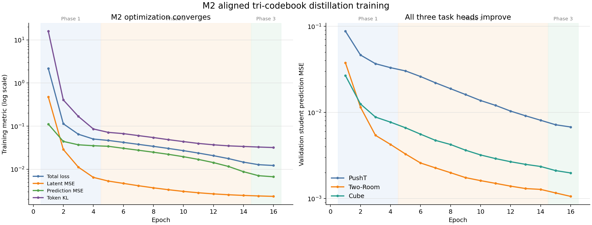
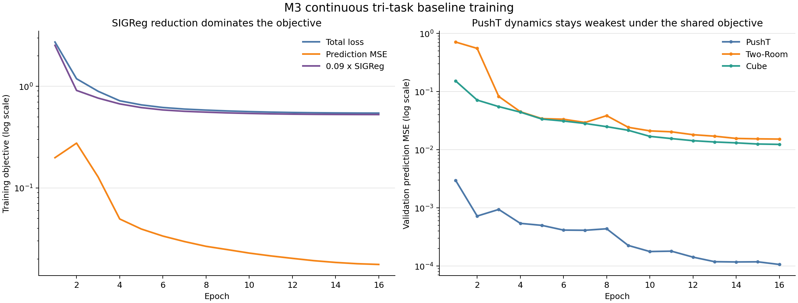

# PushT × Two-Room × Cube 三任务隐空间对齐、码本融合与多任务世界模型实验报告

> 文档状态：全部实验（C0/C1/M0/M2/M3 及追加的 M4/M5 消融）训练与三环境评测已完成，结果表已填入实测值。  
> 创建日期：2026-08-29  
> 最近更新：2026-08-31（补入 M0/M2/M3 实测结果与 M4/M5 教师表示消融）  
> 原双任务报告：docs/pusht_tworoom_alignment_codebook_fusion_results.md（保持不变）

## 1. 结论先行

三任务方案已全部完成训练与评测。新实验使用独立的 pusht_tworoom_cube_* 输出命名，不覆盖 PushT × Two-Room 的报告、checkpoint、缓存、评测 JSON 或日志。

核心结论（Seed=42、每任务 50 episodes、三任务宏平均）：

- **M2（双源对齐 + 顺序 UOT）以 82.0% 宏平均领先所有三任务模型**，比 M0 未对齐负对照（77.3%）高 4.7 个百分点，比 M3 连续 baseline（52.0%）高 30.0 个百分点。M3 在 PushT 上几近崩溃（2/50 = 4%），是拉低其宏平均的主因。
- 本轮顺序 UOT 在 2% QE 退化预算下 **未接受任何 merge（num_merges=0）**，因此 M2 的 K_shared=24576，与 M0 的码本规模相同。M2 相对 M0 的收益完全来自双源 Procrustes 空间对齐，而非码本压缩。
- **M4/M5 教师表示消融**：在 M2 框架上替换第一项对齐目标与第三项动力学 teacher latent 的来源。M4（全部用教师连续向量 z^T，删除码本软 token 项）宏平均 81.3%，与 M2 基本持平（−0.7pp）；M5（全部用离散码本向量 c_{y^T}）宏平均 76.7%，明显低于 M2（−5.3pp）。这说明连续教师表示至少与 M2 混合方案相当，而全离散化会损失精度，主要体现在 PushT（M5 82% vs M2 92%）与 Cube（M5 64% vs M2 68%）。

Cube 的视觉 embedding / latent 空间是 192 维。官方 Cube checkpoint 配置中 predictor、projector、prediction head 和 action embedding 的表示宽度均为 192。Cube 原始动作是 5 维；frameskip=5 后，一个世界模型时间步拼接 5 个动作，因此 action encoder 的输入是 25 维。PushT 和 Two-Room 的 action block 均为 10 维。三任务共享模型将 10 维动作尾部补零到 25 维，再送入同一个 action encoder。

官方来源：

- Cube checkpoint 配置：https://huggingface.co/quentinll/lewm-cube/blob/main/config.json
- Cube 模型页：https://huggingface.co/quentinll/lewm-cube
- Cube 数据集：https://huggingface.co/datasets/quentinll/lewm-cube/tree/main
- LeWM 官方仓库：https://github.com/lucas-maes/le-wm

## 2. 三任务实验矩阵

下表填入全部实测结果（Seed=42、每任务 50 个固定评测起点）。M4/M5 为在 M2 框架上追加的教师表示消融。

| 编号 | 模型 | 码本 | 用途 | PushT 成功率 | Two-Room 成功率 | Cube 成功率 | 三任务宏平均 | 当前状态 |
|---|---|---|---|---:|---:|---:|---:|---|
| P0 | 官方 PushT | 连续 | PushT teacher 上界 | 45/50 = 90% | 不适用 | 不适用 | 不适用 | 复用原报告实测结果 |
| P1 | 单任务 PushT VQ | K=8192, D=192 | PushT 离散基线 | 39/50 = 78% | 不适用 | 不适用 | 不适用 | 复用原报告实测结果 |
| R0 | 官方 Two-Room | 连续 | Two-Room teacher 上界 | 不适用 | 43/50 = 86% | 不适用 | 不适用 | 复用原报告实测结果 |
| R1 | 单任务 Two-Room VQ | K=8192, D=192 | Two-Room 离散基线 | 不适用 | 42/50 = 84% | 不适用 | 不适用 | 复用原报告实测结果 |
| C0 | 官方 Cube | 连续，D=192 | Cube teacher 上界 | 不适用 | 不适用 | 34/50 = 68% | 不适用 | 本地 50-ep 评测完成 |
| C1 | 单任务 Cube VQ | K=8192, D=192 | Cube 离散基线 | 不适用 | 不适用 | 34/50 = 68% | 不适用 | 完成（best_stage=phase2） |
| M0 | 三任务共享模型 | 未对齐 concat，K=24576 | 负对照 | 37/50 = 74% | 42/50 = 84% | 37/50 = 74% | 77.3% | 训练+评测完成 |
| M2 | 三任务共享模型 | 双源 Procrustes + 顺序 UOT，K_shared=24576 | 推荐融合方案 | 46/50 = 92% | 43/50 = 86% | 34/50 = 68% | 82.0% | 训练+评测完成 |
| M3 | 原生三任务模型 | 连续 latent，无对齐、无融合码本 | 等参数连续 baseline | 2/50 = 4% | 46/50 = 92% | 30/50 = 60% | 52.0% | 训练+评测完成 |
| M4 | 三任务共享模型（M2 变体） | 教师连续向量 z^T，删除码本软 token 项 | 教师表示消融：全连续 | 47/50 = 94% | 43/50 = 86% | 32/50 = 64% | 81.3% | 训练+评测完成 |
| M5 | 三任务共享模型（M2 变体） | 离散码本向量 c_{y^T}，保留软 token 项 | 教师表示消融：全离散 | 41/50 = 82% | 42/50 = 84% | 32/50 = 64% | 76.7% | 训练+评测完成 |

三任务宏平均对 M0、M2、M3、M4、M5 定义：

    macro = (PushT 成功率 + Two-Room 成功率 + Cube 成功率) / 3

所有控制成功率继续使用 Seed=42、每任务 50 个固定评测起点。单任务 teacher/VQ 行不与“不适用”任务一起计算宏平均。

关键差值（百分点）：

- M2 − M0 = +4.7pp（对齐相对未对齐 concat 的净收益，码本规模相同 K=24576）
- M2 − M3 = +30.0pp（离散教师约束 + 坐标对齐相对纯连续共享网络）
- M4 − M2 = −0.7pp（第一/三项全用连续 z^T 并删除软 token 项，与 M2 基本持平）
- M5 − M2 = −5.3pp（第一/三项全用离散码本 c_{y^T}，明显劣于 M2 混合方案）

左图为 PushT/Two-Room/Cube 各自官方连续 teacher 与单任务 VQ 的控制损失；右图为 M3、M0、M2 三个共享模型的分任务成功率与三任务宏平均（黑色菱形）。M2 在 PushT 上从 M0 的 74% 提升到 92%，宏平均从 77.3% 提升到 82.0%。

教师表示消融显示：M4（全连续 z^T）宏平均 81.3%，与 M2 混合方案（82.0%）基本持平；M5（全离散码本 c_{y^T}）宏平均降到 76.7%，损失主要出现在 PushT（92%→82%）与 Cube（68%→64%）。

## 3. 复用范围与不覆盖约束

### 3.1 直接复用的已有成果

- 官方 PushT teacher：.stablewm/checkpoints/official_lewm_pusht_compat
- PushT K=8192 码本及 latent 缓存
- 官方 Two-Room teacher：.stablewm/checkpoints/official_lewm_tworooms_compat
- Two-Room K=8192 码本及 latent 缓存
- Two-Room 数据集与现有评测数据
- P0、P1、R0、R1 的 50-episode 实测结果
- 已验证的单源 Similarity Procrustes、UOT、离线缓存、三阶段蒸馏和 MPC 评测实现

旧双任务 M0/M2/M3 的数值只作为历史参考，不直接填入三任务表。三任务增加 Cube 后，数据分布、共享模型和任务条件都发生变化，必须重新训练和评测。

旧的 Two-Room → PushT transform 也不直接复制到新 checkpoint。新实现用 PushT、Two-Room、Cube 三个数据源的同图像 anchors 重新拟合 Two-Room → PushT 和 Cube → PushT 两个 transform，保证两个源任务使用同一校准协议。

### 3.2 全部新增输出

| 产物 | 新路径 |
|---|---|
| Cube 官方兼容 checkpoint | .stablewm/checkpoints/official_lewm_cube_compat |
| Cube 数据 | .stablewm/datasets/quentinll--lewm-cube/cube_single_expert.h5 |
| Cube K=8192 码本 | .stablewm/checkpoints/official_lewm_cube_compat_codebook_k8192 |
| Cube 单任务 VQ | .stablewm/joint_distillation/lewm_cube_k8192_seed3072 |
| 三任务双源对齐 | .stablewm/multitask/pusht_tworoom_cube_alignment.pt |
| M2 顺序 UOT 码本 | .stablewm/checkpoints/pusht_tworoom_cube_fused_uot |
| M0 未对齐 concat 码本 | .stablewm/checkpoints/pusht_tworoom_cube_fused_unaligned_concat |
| M2 离线缓存 | .stablewm/distillation_cache/pusht_tworoom_cube_fused |
| M0 离线缓存 | .stablewm/distillation_cache/pusht_tworoom_cube_unaligned_concat |
| M2 模型 | .stablewm/multitask_distillation/pusht_tworoom_cube_uot_seed3072 |
| M0 模型 | .stablewm/multitask_distillation/pusht_tworoom_cube_m0_unaligned_concat_seed3072 |
| M3 模型 | .stablewm/multitask_baseline/pusht_tworoom_cube_m3_seed3072 |
| 流水线日志 | logs/pusht_tworoom_cube_gpu0123 |

流水线对每个新产物都有存在性检查：已有有效 checkpoint、cache metadata 或 evaluation summary 时直接复用。原报告路径和所有 pusht_tworoom_* 双任务路径均不作为写入目标。

## 4. 表示空间与动作兼容

| 任务 | 视觉 latent | 原始 action | frameskip | 模型 action block |
|---|---:|---:|---:|---:|
| PushT | 192 | 2 | 5 | 10 |
| Two-Room | 192 | 2 | 5 | 10 |
| Cube | 192 | 5 | 5 | 25 |

视觉空间三者同为 D=192，因此 Procrustes 和共享码本不需要升降维投影。动作空间维度不同，不能直接在 balanced batch 中拼接。本实现采用两层保护：

1. BalancedLoader 在跨任务拼 batch 前，将每个 action block 补零到该批次最大宽度 25；
2. PaddedActionEncoder 再次校验输入宽度，并将短输入补到共享 action encoder 的固定 input_dim=25；宽度大于 25 时直接报错。

这样不改变 Cube 动作，同时保持 PushT/Two-Room 的 10 个真实动作分量，新增的 15 个分量固定为零。

三个单任务 K=8192 码本的离线量化质量和利用率如下图。PushT 与 Cube 的 test relative L2（约 20.6% 与 24.9%）明显高于 Two-Room（约 7.7%），说明这两个任务的 latent 更难被 K=8192 码本紧凑量化；三个码本的 validation 利用率（active codes / K）都在 85%–93%。

## 5. M0、M2、M3 设计

### 5.1 M0：未对齐负对照

- 三个 K=8192 单任务码本按 PushT、Two-Room、Cube 顺序直接拼接；
- 不应用任何空间对齐；
- 不运行 UOT 合并；
- 固定 K=24576；
- 三任务共享 student、predictor、action encoder 和 task embedding；
- 各任务教师 latent 保持在自己的原坐标系中。

M0 检验“扩大共享表并加入第三任务”本身能否工作，也为 M2 的对齐收益提供受控对照。

M2 的训练收敛与三任务 validation prediction MSE 如下图。三阶段（4/10/2 epochs）调度下 total loss 从约 2.18 单调降到约 0.012，三个任务头的 student prediction MSE 到 epoch 16 分别收敛到 PushT≈0.0068、Two-Room≈0.0011、Cube≈0.0020。

### 5.2 M2：双源对齐 + 顺序 UOT

参考空间固定为 PushT：

    Two-Room --Similarity Procrustes--> PushT space
    Cube     --Similarity Procrustes--> PushT space

两个变换独立拟合，但使用相同的三任务 anchor 池、相同 train/held-out 划分协议。每个 transform 都记录 held-out MSE、cosine、R²、effective rank、CCA、round-trip error；单任务 token assignment 通过“同时变换 latent 与 codebook”保持。

下图对比两个源任务对齐前（identity）与 Similarity 对齐后的 held-out 指标。Two-Room → PushT 的 MSE 改善约 8.06×（3.63→0.45），Cube → PushT 改善约 3.36×（1.70→0.51）；两个 transform 的 source token preservation 均为 100%，round-trip 误差在 1e-5 量级。对齐后 cosine similarity 提升到约 0.60（Two-Room）与 0.58（Cube），但 R²（0.19 / 0.09）仍偏低，说明刚性 Similarity 映射只解释了部分跨 teacher 差异——这与双任务报告的结论一致。

UOT 采用顺序融合：

1. PushT K8192 与已对齐 Two-Room K8192 做第一阶段 UOT；
2. 第一阶段的 fused table 与已对齐 Cube K8192 做第二阶段 UOT；
3. 第二阶段统计使用已纳入任务的等量 latent 池，避免大数据任务支配质量统计；
4. 每个候选都在当前已纳入的全部任务 validation latent 上重新计算量化 MSE；
5. 每任务 QE 退化预算均为 2%；
6. 评分优先最大化安全 merge 数，再最小化最坏 QE ratio；
7. 已有 fused token id 不重排；每任务保存独立 task_token_maps。

若两个阶段都接受 0 merges，则 K_shared=24576；若有安全 merge，则 K_shared<24576。实际 K 必须以新 metadata.json 为准，不能根据双任务的“0 merges”预先断言三任务也为零。

本轮实测两个阶段均为 0 merges：第一阶段（PushT + Two-Room）180 个 mutual candidates → 0 merges → K=16384；第二阶段（+ Cube）362 个 mutual candidates → 0 merges → K=24576。因此在 2% 每任务 QE 退化预算下，最终 K_shared=24576（= 3×8192），M2 相对 M0 的收益完全来自双源坐标对齐，而非码本压缩。

### 5.3 M3：连续三任务 baseline

- 不读取 teacher latent；
- 不读取单任务或融合码本；
- 使用同规格 ViT-Tiny、projector、adapter、predictor、prediction head、action encoder 和三任务 embedding；
- 使用三任务平衡采样和相同的 16 epochs；
- 在三套环境上分别导出/评测同一个共享模型。

M3 用于区分“离散教师约束和坐标对齐”的收益与“仅共享网络”的收益。

M3 的训练动态如下图。加权 SIGReg（0.09×SIGReg）在整个训练中主导总目标；三个任务的 validation prediction MSE 中，PushT 始终是最弱的一项（评测阶段仅 4% 成功率），Two-Room 与 Cube 的 latent 预测误差则持续下降。这与评测结果一致：M3 在 PushT 上几近崩溃，是拉低其 52.0% 宏平均的主因。

### 5.4 M4、M5：教师表示消融（在 M2 框架上追加）

M4、M5 在 M2 的三任务共享模型、双源对齐 + 顺序 UOT 融合码本、相同训练设置（阶段/epochs/优化器/seed/GPU/batch）之上，只修改损失函数中教师表示的来源，用于对比“教师编码器输出的连续、量化前向量 z^T = E_T(o)”与“量化后码本向量 c_{y^T}（y^T = argmin_k ||z^T − c_k||）”的效果。三项损失记为：第一项连续表示对齐、第二项冻结码本上的软 token KL、第三项动力学预测（其中 teacher-forcing 按 m ~ Bernoulli(α) 混合，h_t = (1−m)·teacher + m·z_t^S，预测输入和下一时刻目标同源）。

- **M4（全部用连续向量）**：
  - 第一项对齐目标改为对连续向量 z^T 计算 MSE（与 M2 相同，不变）；
  - 第二项软 token 对齐删除（token_weight = 0）；
  - 第三项动力学 teacher latent 使用 z^T = E_T(o_t)（即 prediction_source = continuous）。
- **M5（全部用离散码本向量）**：
  - 第一项对齐目标由“对连续 z^T 的 MSE”改为“对离散码本向量 c_{y^T} 的 MSE”（latent_target = codebook）；
  - 第二项、第三项保持与 M2 一致（token_weight = 0.1 保留；prediction_source = codebook）；
  - 即全部使用码本向量，不使用连续、量化前向量。

实现上，MultiTaskObjective 增加了三个配置开关：latent_target ∈ {continuous, codebook}、prediction_source ∈ {continuous, codebook}、token_weight（为 0 时完全跳过第二项）。默认值精确复现 M2，因此该改动对 M0/M2/M3 为无操作。M4/M5 复用 M2 已生成的融合码本与逐帧蒸馏缓存，无需重新缓存。

## 6. 数据、训练和评测协议

- 训练 seed：3072
- MPC 评测 seed：42
- 每任务评测：50 episodes
- 输入：224×224 RGB
- latent：192
- history：3
- 训练窗口：4 帧
- frameskip：5
- 多任务数：3
- 训练 GPU：0/1/2/3，world size=4
- C1 train batch：每 GPU 192，global batch=768（与原 3×256 相同）
- M0/M2/M3：每任务每 GPU 96，global per-task batch=384，三任务合计 1152（与原 3×128 相同）
- C1 cache batch：每 GPU 384；多任务 cache batch：每 GPU 192；两者均保持原 global batch
- CPU workers total：108；C1 为每 rank 27，三任务训练为每 rank/每 task 9
- OMP/MKL/OpenBLAS/NumExpr：每进程 1 thread
- precision：bf16-mixed
- M0/M2 阶段：4/10/2 epochs
- M3：16 epochs
- 每个 optimizer step 对三个任务等量采样
- 各任务数据 split seed 固定；M3 只复用新 M2 cache 中的 split indices，不读取教师数组
- 三任务评测并行分配到 GPU 0/1/2

M0 与 M2 采用相同的三阶段调度、global batch、训练任务顺序和评测协议。M3 使用相同三任务 batch 规模和 GPU 数，但优化目标按连续 baseline 保留 SIGReg，因此比较时仍需注明训练目标不同。

## 7. 实现文件

### 7.1 新增

- scripts/train/fit_multitask_latent_alignments.py：一次生成 Two-Room 和 Cube 到 PushT 的多源对齐 checkpoint
- scripts/train/build_multitask_fused_codebook.py：任意任务顺序的 concat / 顺序 UOT 融合
- scripts/train/prepare_cube_assets.py：幂等下载并校验官方 Cube 模型和数据
- scripts/train/config/multitask_vq_lewm_three_tasks.yaml：M2
- scripts/train/config/multitask_vq_lewm_three_tasks_m0_unaligned.yaml：M0
- scripts/train/config/multitask_lewm_three_tasks_baseline.yaml：M3
- scripts/train/config/vq_lewm_joint_distillation_cube.yaml：C1
- scripts/train/config/multitask_vq_lewm_three_tasks_m4_continuous.yaml：M4（教师全连续向量消融，token_weight=0）
- scripts/train/config/multitask_vq_lewm_three_tasks_m5_codebook.yaml：M5（教师全离散码本向量消融）
- scripts/train/run_pusht_tworoom_cube_all_gpu012.sh：参数化 GPU 列表；当前使用 GPU 0/1/2/3、world size=4
- scripts/train/run_pusht_tworoom_cube_m4_m5_gpu0123.sh：M4/M5 续跑器，等待 M2 orchestrator 退出并确认 complete 后再占用 GPU，串起 M4/M5 的训练与评测（幂等，可断点续跑）
- tests/wm/test_three_task_fusion.py：动作 padding、多源对齐和输出隔离测试
- scripts/train/plot_pusht_tworoom_cube_report_figures.py：从 .stablewm 下的评测 JSON / metadata / metrics 生成本报告全部图表（输出到 docs/assets/pusht_tworoom_cube_fusion/，因容器无 CJK 字体，图内文字为英文，与既有双任务报告图一致）

### 7.2 扩展且保持双任务兼容

- stable_worldmodel/wm/vq_lewm/alignment.py：兼容旧单源 checkpoint，并支持多源 alignment bundle
- stable_worldmodel/wm/vq_lewm/multitask.py：新增 PaddedActionEncoder
- scripts/train/cache_multitask_distillation.py：按 task name 应用对应 alignment
- scripts/train/multitask_vq_lewm_distillation.py：支持不同 action width 的三任务 batch；MultiTaskObjective 新增 latent_target / prediction_source / token_weight 开关（默认精确复现 M2），支撑 M4/M5 教师表示消融
- scripts/train/multitask_lewm_baseline.py：连续 baseline 同样支持不同 action width

## 8. 当前验证结果

已完成：

- Python 语法检查：通过
- Shell 流水线 bash -n：通过
- 四份新配置 OmegaConf 解析与路径隔离检查：通过
- 三任务 + 双任务兼容定向测试：17 passed
- CPU 两阶段顺序 UOT 合成冒烟：
  - 第一阶段：K=2+2 → K=3，1 merge
  - 第二阶段：K=3+2 → K=3，2 merges
  - 两阶段已有 token id 均保持
- 旧报告 SHA-256：ade36017ef75894e4b45f1984a9af9c1f366a8aa86ae07864afa9a91635fdf6e
- 官方 Cube 原始 checkpoint 已保留，兼容 checkpoint strict=True 加载：通过
- Cube 资产准备连续两次幂等校验：通过

全部完成（2026-08-31）：

- Cube C0 官方 teacher 本地 50-episode 评测：success_rate = 68%
- Cube C1 单任务蒸馏及评测：best_stage = phase2，success_rate = 68%（34/50）
- 三任务对齐与顺序 UOT 融合：num_merges = 0，K_shared = 24576（本轮 2% QE 预算下未接受 merge）
- M0、M2、M3 的完整训练与三环境评测：见第 2 节结果表
- M4、M5 教师表示消融的完整训练与三环境评测：见第 2 节结果表
- 三任务宏平均和统计结论：见第 1 节

## 9. 运行状态（已完成）

全部流水线已结束。基础 orchestrator（run_pusht_tworoom_cube_all_gpu012.sh，PID 3531921）于 2026-08-30 19:45:20 UTC 记录 all_three_task_experiments_complete，完成 C0/C1/M0/M2/M3 的训练与三环境评测。

M4/M5 续跑器（run_pusht_tworoom_cube_m4_m5_gpu0123.sh，PID 3798521）在基础 orchestrator 运行期间全程 sleep 等待，不占用 GPU；检测到其退出并确认 status.txt 为 complete、M2 weights_final.pt 存在后，于 2026-08-30 19:45:36 UTC 依次启动 M4/M5，未与基础训练争抢显卡。关键阶段时间戳：

- 2026-08-30T19:45:36Z three_task_m4_train_gpu0123
- 2026-08-31T03:39:30Z three_task_m4_evaluation_gpu012
- 2026-08-31T03:41:57Z three_task_m5_train_gpu0123
- 2026-08-31T11:37:14Z three_task_m5_evaluation_gpu012
- 2026-08-31T11:39:44Z m4_m5_experiments_complete

M4、M5 均训练满 16 epochs，各自 weights_final.pt 与 task_evaluation/summary.json 已落盘。日志侧面确认消融生效：M4 全程 token_kl = 0（第二项已关闭），M4/M5 的 latent_mse 与 prediction_mse 正常收敛。

产物路径：

- M4：.stablewm/multitask_distillation/pusht_tworoom_cube_m4_continuous_seed3072/
- M5：.stablewm/multitask_distillation/pusht_tworoom_cube_m5_codebook_seed3072/
- M4/M5 阶段日志：logs/pusht_tworoom_cube_gpu0123/stages_m4_m5.log、status_m4_m5.txt
- M4/M5 训练与评测日志：logs/pusht_tworoom_cube_gpu0123/{m4,m5}_{train,evaluation}.log

## 10. 结果填写准则

完整实验结束后，只从 JSON/metadata 自动或人工核对填入：

- C0：官方 Cube teacher 的 cube_results_official_seed42_50.json
- C1：Cube 单任务各阶段结果，使用与 P1/R1 相同的最佳阶段选择规则
- M0/M2/M3：各自 task_evaluation/summary.json
- M2 实际 K_shared、每阶段 merge 数、三任务 QE ratios
- 三任务宏平均与 M2−M0、M2−M3 的百分点差

在这些文件实际生成前，本报告中的待评估字段必须保持为空，避免把设计目标当成实验结论。

