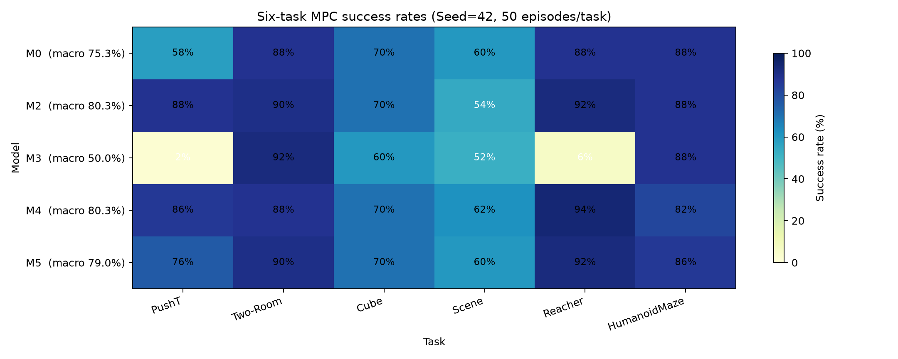

# PushT × Two-Room × Cube × Scene × Reacher × HumanoidMaze 六任务隐空间对齐、码本融合与多任务世界模型实验报告

> 文档状态：六任务 M0/M2/M3 主线及 M4/M5 教师表示消融均已完成训练和评测，结果已按 JSON/metadata 核对。
> 创建日期：2026-09-05；最近更新：2026-09-13
> 实验日志目录：`logs/pusht_tworoom_cube_scene_reacher_humanoidmaze_gpu0123/`
> 相关报告：`docs/pusht_tworoom_cube_alignment_codebook_fusion_results.md`

## 1. 结论先行

在 Seed=42、每任务 50 个固定起点的 MPC 评测中，**M2（五源 Similarity Procrustes 对齐 + 顺序 UOT）和 M4（全连续教师表示）并列取得最高六任务宏平均 80.3%**。M2 比未对齐 concat 负对照 M0 高 **5.0 个百分点**，比连续 baseline M3 高 **30.3 个百分点**。

- M2 的分任务成功率为 PushT 88%、Two-Room 90%、Cube 70%、Scene 54%、Reacher 92%、HumanoidMaze 88%；相对 M0 的主要收益来自 PushT（+30pp）和 Reacher（+4pp），Scene 下降 6pp，Cube/HumanoidMaze 持平。
- 顺序 UOT 在每任务 2% QE 退化预算下五个阶段均为 0 merge，最终共享码本为 **K=49,152=6×8,192**。因此 M2 相对 M0 的收益来自坐标对齐和教师约束，而非码本压缩。
- M3 在 PushT（2%）和 Reacher（6%）上出现明显控制崩溃，宏平均只有 50.0%；仅共享连续网络不足以处理六种 latent/action 分布。
- M4 宏平均与 M2 持平；M5（全离散码本教师）为 79.0%，比 M2 低 1.3pp，说明混合/连续教师表示更稳健。

## 2. 六任务实验矩阵

成功率均为 `成功回合数/50`，宏平均为六个任务成功率的算术平均。

| 编号 | 模型 | 码本/教师 | PushT | Two-Room | Cube | Scene | Reacher | HumanoidMaze | 六任务宏平均 | 状态 |
|---|---|---|---:|---:|---:|---:|---:|---:|---:|---|
| P0 | 官方 PushT teacher | 连续 | 45/50=90% | — | — | — | — | — | — | 已复用 |
| P1 | PushT 单任务 VQ | K=8192 | 39/50=78% | — | — | — | — | — | — | 已复用 |
| R0 | 官方 Two-Room teacher | 连续 | — | 43/50=86% | — | — | — | — | — | 已复用 |
| R1 | Two-Room 单任务 VQ | K=8192 | — | 42/50=84% | — | — | — | — | — | 已复用 |
| C0 | 官方 Cube teacher | 连续 | — | — | 34/50=68% | — | — | — | — | 已复用 |
| C1 | Cube 单任务 VQ | K=8192 | — | — | 34/50=68% | — | — | — | — | 已复用 |
| S0 | Scene scratch teacher | 连续 | — | — | — | 32/50=64% | — | — | — | 已完成 |
| S1 | Scene 单任务 VQ | K=8192 | — | — | — | 32/50=64% | — | — | — | 已完成 |
| H0 | HumanoidMaze scratch teacher | 连续 | — | — | — | — | — | 42/50=84% | — | 已完成 |
| H1 | HumanoidMaze 单任务 VQ | K=8192 | — | — | — | — | — | 43/50=86% | — | 已完成 |
| Q0 | Reacher 官方 teacher | 连续 | — | — | — | — | 47/50=94% | — | — | 已复用 |
| Q1 | Reacher 单任务 VQ | K=8192 | — | — | — | — | 49/50=98% | — | — | 已完成 |
| M0 | 六任务共享模型 | 未对齐 concat，K=49152 | 29/50=58% | 44/50=88% | 35/50=70% | 30/50=60% | 44/50=88% | 44/50=88% | **75.3%** | 已完成 |
| M2 | 六任务共享模型 | 五源对齐 + 顺序 UOT，K=49152 | 44/50=88% | 45/50=90% | 35/50=70% | 27/50=54% | 46/50=92% | 44/50=88% | **80.3%** | 已完成 |
| M3 | 原生六任务连续 baseline | 连续 latent，无码本 | 1/50=2% | 46/50=92% | 30/50=60% | 26/50=52% | 3/50=6% | 44/50=88% | **50.0%** | 已完成 |
| M4 | 六任务共享模型（M2 变体） | 全连续教师向量，token_weight=0 | 43/50=86% | 44/50=88% | 35/50=70% | 31/50=62% | 47/50=94% | 41/50=82% | **80.3%** | 已完成 |
| M5 | 六任务共享模型（M2 变体） | 全离散码本向量 | 38/50=76% | 45/50=90% | 35/50=70% | 30/50=60% | 46/50=92% | 43/50=86% | **79.0%** | 已完成 |

关键差值：M2−M0=+5.0pp，M2−M3=+30.3pp，M4−M2=0.0pp（四舍五入后持平），M5−M2=−1.3pp。六个单任务 VQ 最佳结果的宏平均为 79.7%，M2 仍高 0.7pp。

## 3. 任务、数据与动作兼容

| 任务 | 视觉 latent | 原始 action | frameskip | action block | teacher 来源 |
|---|---:|---:|---:|---:|---|
| PushT | 192 | 2 | 5 | 10 | 官方兼容 checkpoint |
| Two-Room | 192 | 2 | 5 | 10 | 官方兼容 checkpoint |
| Cube | 192 | 5 | 5 | 25 | 官方兼容 checkpoint |
| Scene | 192 | 5 | 5 | 25 | scratch，seed=3072 |
| Reacher | 192 | 2 | 5 | 10 | 官方 `lewm-reacher` |
| HumanoidMaze | 192 | 21 | 5 | 105 | scratch，seed=3072 |

六个任务视觉表示宽度均为 D=192。共享 action encoder 固定输入宽度为 105；BalancedLoader 和 `PaddedActionEncoder` 对短 action block 补零，保留真实动作分量，不改变任何任务的动作语义。任务顺序固定为 `[pusht, tworoom, cube, scene, reacher, humanoidmaze]`。

Scene 与 HumanoidMaze 使用 OGBench 数据转换后的 H5 数据和本仓库 scratch teacher；Reacher 使用官方模型与 `reacher.h5`。数据路径和 teacher 路径均记录在六任务 YAML 中。

## 4. 五源隐空间对齐

PushT 作为参考空间，分别拟合 `Two-Room/Cube/Scene/Reacher/HumanoidMaze → PushT` 的 Similarity Procrustes 变换。每个源任务使用 32,768 个 anchors，train fraction=0.9，split seed=4242。

| 源任务 | identity held-out MSE | 对齐后 MSE | 改善倍数 | 对齐后 cosine | R² | round-trip 最大误差 | token preservation |
|---|---:|---:|---:|---:|---:|---:|---:|
| Two-Room | 4.0351 | 0.2677 | 15.08× | 0.7488 | 0.2364 | 9.06e−6 | 1.000000 |
| Cube | 1.3149 | 0.2900 | 4.53× | 0.7459 | 0.1728 | 3.10e−6 | 1.000000 |
| Scene | 1.3176 | 0.2663 | 4.95× | 0.7447 | 0.2402 | 3.10e−6 | 1.000000 |
| Reacher | 1.4326 | 0.2993 | 4.79× | 0.7327 | 0.1460 | 3.34e−6 | 0.999949 |
| HumanoidMaze | 1.1152 | 0.2892 | 3.86× | 0.7199 | 0.1749 | 2.86e−6 | 1.000000 |

变换显著降低 held-out MSE，且 token id 保持率约 100%；R² 仍只有 0.15–0.24，表示对齐消除了主要坐标差异，但没有把任务动力学变成同一分布。

## 5. 顺序 UOT 融合

融合参考为 PushT，按 `PushT → Two-Room → Cube → Scene → Reacher → HumanoidMaze` 顺序执行。每个任务 K=8192，统计样本数为 262,144/task，QE 退化预算为 2%。

| 阶段 | 新加入任务 | mutual candidates | merges | 阶段后 K |
|---:|---|---:|---:|---:|
| 1 | Two-Room | 133 | 0 | 16,384 |
| 2 | Cube | 380 | 0 | 24,576 |
| 3 | Scene | 2,262 | 0 | 32,768 |
| 4 | Reacher | 730 | 0 | 40,960 |
| 5 | HumanoidMaze | 1,792 | 0 | 49,152 |

六任务基线量化 MSE（`m2_uot_fusion.log`）为：PushT 0.056139、Two-Room 0.0002435、Cube 0.007375、Scene 0.005735、Reacher 0.000619、HumanoidMaze 0.001182；最终各任务 quantization MSE ratio 均为 1.0。

## 6. 模型设计与消融

- **M0**：六个 K=8192 码本直接 concat，不做空间对齐或 UOT，固定 K=49152，用作负对照。
- **M2**：五源 Procrustes 对齐后执行顺序 UOT；共享 student、predictor、projector、prediction head、action encoder 和 task embedding。
- **M3**：同规格六任务连续模型，使用 SIGReg 权重 0.09，不读取 teacher latent 或码本，训练 16 epochs。
- **M4**：沿用 M2，但第一项和动力学 teacher latent 全部使用连续向量 `z^T`，并删除软 token 项（`token_weight=0`）。
- **M5**：第一项和动力学 teacher latent 全部使用离散码本向量 `c_{y^T}`，保留软 token 项。

M2 epoch 16 的六任务 validation student prediction MSE 依次为 PushT 0.00738、Two-Room 0.00124、Cube 0.00279、Scene 0.00234、Reacher 0.00316、HumanoidMaze 0.00158；总 loss 为 0.00967。M0 总 loss 为 0.03242，M3 的 prediction MSE/SIGReg 分量为 0.01833/14.0063，M4/M5 总 loss 分别为 0.00441/0.01909。

## 7. 训练与评测协议

- 训练 seed=3072；MPC 评测 seed=42；每任务 50 episodes。
- 输入 224×224 RGB，latent=192，history=3，训练窗口 4 帧，frameskip=5。
- M0/M2/M4/M5 三阶段为 4/10/2 epochs；M3 为 16 epochs；精度为 `bf16-mixed`。
- 训练使用 GPU 0/1/2/3，world size=4；六任务每任务每 GPU batch=96，global per-task batch=384，六任务合计 global batch=2304；cache batch=192/GPU。
- CPU workers total=108；OMP/MKL/OpenBLAS/NumExpr 每进程 1 thread；评测设备映射为 `[0,1,2,3,0,1]`。
- M2/M0 共享相同数据 split 和训练任务顺序；M3 只复用 split indices，不读取教师数组。

## 8. 产物与实现文件

主要新增产物：

| 产物 | 路径 |
|---|---|
| 五源对齐 bundle | `.stablewm/multitask/pusht_tworoom_cube_scene_reacher_humanoidmaze_alignment.pt` |
| M2 UOT 码本 | `.stablewm/checkpoints/pusht_tworoom_cube_scene_reacher_humanoidmaze_fused_uot` |
| M0 concat 码本 | `.stablewm/checkpoints/pusht_tworoom_cube_scene_reacher_humanoidmaze_fused_unaligned_concat` |
| M2/M0 cache | `.stablewm/distillation_cache/pusht_tworoom_cube_scene_reacher_humanoidmaze_{fused,unaligned_concat}` |
| M0/M2/M4/M5 模型 | `.stablewm/multitask_distillation/pusht_tworoom_cube_scene_reacher_humanoidmaze_{m0_unaligned_concat,uot,m4_continuous,m5_codebook}_seed3072` |
| M3 模型 | `.stablewm/multitask_baseline/pusht_tworoom_cube_scene_reacher_humanoidmaze_m3_seed3072` |
| 六任务流水线日志 | `logs/pusht_tworoom_cube_scene_reacher_humanoidmaze_gpu0123` |

核心配置为 `scripts/train/config/multitask_vq_lewm_six_tasks.yaml`、`..._m0_unaligned.yaml`、`..._m4_continuous.yaml`、`..._m5_codebook.yaml` 和 `scripts/train/config/multitask_lewm_six_tasks_baseline.yaml`。六任务动作 padding、对齐 bundle、配置和输出隔离测试位于 `tests/wm/test_six_task_fusion.py`。

## 9. 验证结果与运行状态

- `status.txt`：`2026-09-08T23:03:38Z complete`。
- `status_m4_m5.txt`：`2026-09-10T08:50:17Z complete`。
- 主线日志包含 teacher、单任务 K8192、alignment、UOT、M0/M2/M3 训练与评测；M4/M5 日志分别记录续跑训练与评测。
- 最终评测 JSON 均包含 50 个固定起点、episode successes、success rate、checkpoint 和配置路径；单任务结果来自各自 `task_evaluation/summary.json`，多任务结果来自五个模型目录下的 `task_evaluation/summary.json`。
- 日志中的 `libnvrtc.so.13`/torchcodec 探测和 `broadcast_buffers` FutureWarning 未阻断流程；所有训练、评测和 summary 均已正常落盘。

## 10. 结果来源与填写准则

本报告的成功率仅从以下落盘文件读取：

- M0：`.stablewm/multitask_distillation/pusht_tworoom_cube_scene_reacher_humanoidmaze_m0_unaligned_concat_seed3072/task_evaluation/summary.json`
- M2：`.stablewm/multitask_distillation/pusht_tworoom_cube_scene_reacher_humanoidmaze_uot_seed3072/task_evaluation/summary.json`
- M3：`.stablewm/multitask_baseline/pusht_tworoom_cube_scene_reacher_humanoidmaze_m3_seed3072/task_evaluation/summary.json`
- M4/M5：各自 `.../task_evaluation/summary.json`
- 单任务 C1：`.stablewm/joint_distillation/lewm_{scene,reacher,humanoidmaze}_k8192_seed3072/task_evaluation/summary.json`，PushT/Two-Room/Cube 沿用已完成单任务 summary。
- 对齐指标与 token preservation：`.stablewm/multitask/pusht_tworoom_cube_scene_reacher_humanoidmaze_alignment.pt` 及 `alignment.log`。
- UOT 阶段、候选数、merge 数、QE ratio：`m2_uot_fusion.log` 和 `.stablewm/checkpoints/pusht_tworoom_cube_scene_reacher_humanoidmaze_fused_uot/metadata.json`。

宏平均统一按六任务成功率求平均，百分比差异使用百分点（pp）。如果后续重跑改变 seed、评测起点、任务顺序或输出目录，必须新建对应报告或明确替换来源，不能把设计目标或旧双/三任务结果填入本表。
